# Shurli Architecture

This document describes the technical architecture of Shurli, from current implementation to future vision.

## Table of Contents

- [Current Architecture (Phase 9B + Plugin Architecture Complete)](#current-architecture-phase-9b--plugin-architecture-complete) - what's built and working
- [Plugin Architecture](#plugin-architecture) - extensibility framework, three-layer evolution
- [Target Architecture (Phase 9C+)](#target-architecture-phase-9c) - planned additions
- [Observability (Batch H)](#observability-batch-h) - Prometheus metrics, audit logging
- [Adaptive Path Selection (Batch I)](#adaptive-path-selection-batch-i) - interface discovery, dial racing, STUN, peer relay
  - [libp2p Upstream Overrides](#libp2p-upstream-overrides) - where Shurli diverges from stock libp2p
- [Core Concepts](#core-concepts) - implemented patterns
- [Security Model](#security-model) - implemented + planned extensions
  - [Role-Based Access Control (Phase 6)](#role-based-access-control-phase-6) - admin/member tiers
  - [Macaroon Capability Tokens (Phase 6)](#macaroon-capability-tokens-phase-6) - HMAC-chain bearer tokens
  - [Passphrase-Sealed Vault (Phase 6)](#passphrase-sealed-vault-phase-6) - relay key protection
  - [Async Invite Deposits (Phase 6)](#async-invite-deposits-phase-6) - client-deposit invites
  - [ZKP Privacy Layer (Phase 7)](#zkp-privacy-layer-phase-7) - anonymous membership proofs
  - [Anonymous Relay Authorization (Phase 7)](#anonymous-relay-authorization-phase-7) - challenge-response auth
  - [Private Reputation (Phase 7)](#private-reputation-phase-7) - range proofs on scores
  - [BIP39 Key Management (Phase 7)](#bip39-key-management-phase-7) - deterministic circuit keys
  - [Unified Seed Architecture (Phase 8)](#unified-seed-architecture-phase-8) - one BIP39 seed for all keys
  - [Encrypted Identity (Phase 8)](#encrypted-identity-phase-8) - password-protected identity.key for all nodes
  - [Remote Admin Protocol (Phase 8)](#remote-admin-protocol-phase-8) - full relay management over P2P
  - [MOTD and Goodbye (Phase 8)](#motd-and-goodbye-phase-8) - signed operator announcements
  - [Session Tokens (Phase 8)](#session-tokens-phase-8) - machine-bound auto-decrypt, lock/unlock
  - [File Transfer (Phase 9B)](#file-transfer-phase-9b) - chunked P2P transfer, erasure coding, multi-source (plugin)
  - [Plugin System](#plugin-system) - Plugin interface, registry, lifecycle, supervisor
- [Naming System](#naming-system) - local names implemented, network-scoped and blockchain planned
- [Federation Model](#federation-model) - planned (Phase 13)
- [Mobile Architecture](#mobile-architecture) - planned (Phase 12)

---

## Current Architecture (Phase 9B + Plugin Architecture Complete)

### Component Overview

```
Shurli/
├── cmd/
│   ├── shurli/              # Single binary with subcommands
│   │   ├── main.go          # Command dispatch (daemon, ping, traceroute, resolve,
│   │   │                    #   proxy, whoami, auth, relay, config, service, invite,
│   │   │                    #   join, verify, plugin, status, init, recover,
│   │   │                    #   change-password, lock, unlock, session, doctor,
│   │   │                    #   completion, man, version)
│   │   │                    #   + plugin-injected: send, download, share, browse,
│   │   │                    #   transfers, accept, reject, cancel, clean
│   │   ├── cmd_daemon.go    # Daemon mode + client subcommands (status, stop, ping, etc.)
│   │   ├── serve_common.go  # Shared P2P runtime (serveRuntime) - used by daemon
│   │   ├── cmd_init.go      # Interactive setup wizard
│   │   ├── cmd_proxy.go     # TCP proxy client
│   │   ├── cmd_ping.go      # Standalone P2P ping (continuous, stats)
│   │   ├── cmd_traceroute.go # Standalone P2P traceroute
│   │   ├── cmd_resolve.go   # Standalone name resolution
│   │   ├── cmd_whoami.go    # Show own peer ID
│   │   ├── cmd_auth.go      # Auth add/list/remove/validate subcommands
│   │   ├── cmd_relay.go     # Relay add/list/remove subcommands
│   │   ├── cmd_service.go   # Service add/list/remove subcommands
│   │   ├── cmd_config.go    # Config validate/show/rollback/apply/confirm
│   │   ├── cmd_invite.go    # Generate invite code + QR + P2P handshake (--non-interactive)
│   │   ├── cmd_join.go      # Decode invite, connect, auto-configure (--non-interactive, env var)
│   │   ├── cmd_status.go    # Local status: version, peer ID, config, services, peers
│   │   ├── cmd_verify.go    # SAS verification (4-emoji fingerprint)
│   │   ├── cmd_relay_serve.go # Relay server: serve/authorize/info/config
│   │   ├── cmd_relay_vault.go # Vault CLI: init/seal/unseal/status
│   │   ├── cmd_relay_invite.go # Invite CLI: create/list/revoke/modify
│   │   ├── cmd_relay_zkp.go  # ZKP setup: BIP39 seed, SRS, proving/verifying keys
│   │   ├── cmd_relay_motd.go # MOTD/goodbye CLI: set/clear/status, goodbye set/retract/shutdown
│   │   ├── cmd_relay_remote.go # Remote admin --remote flag dispatcher
│   │   ├── cmd_plugin.go      # Plugin CLI: list/enable/disable/info/disable-all
│   │   ├── cmd_relay_recover.go # Relay identity recovery from seed phrase
│   │   ├── cmd_relay_setup.go # Relay interactive setup wizard
│   │   ├── cmd_recover.go    # Top-level identity recovery from seed phrase
│   │   ├── cmd_change_password.go # Top-level password change
│   │   ├── cmd_lock.go       # Lock/unlock/session commands
│   │   ├── cmd_seed_helpers.go # Shared seed confirmation quiz + password prompts
│   │   ├── cmd_doctor.go     # Health check + auto-fix (completions, man page, config)
│   │   ├── cmd_completion.go # Shell completion scripts (bash, zsh, fish)
│   │   ├── cmd_man.go        # troff man page (display, install, uninstall)
│   │   ├── config_template.go # Shared node config YAML template (single source of truth)
│   │   ├── relay_input.go   # Flexible relay address parsing (IP, IP:PORT, multiaddr)
│   │   ├── seeds.go         # Hardcoded bootstrap seeds + DNS seed domain constant
│   │   ├── serve_common.go  # Shared runtime setup (daemon + relay: P2P, metrics, watchdog)
│   │   ├── daemon_launch.go # Service manager restart (launchd/systemd kick)
│   │   ├── flag_helpers.go  # Shared CLI flag parsing helpers
│   │   └── exit.go          # Testable os.Exit wrapper
│
├── pkg/p2pnet/              # Importable P2P library
│   ├── network.go           # Core network setup, relay helpers, name resolution
│   ├── service.go           # Service registry (register/unregister, expose/unexpose)
│   ├── proxy.go             # Bidirectional TCP↔Stream proxy with half-close + byte counting
│   ├── naming.go            # Local name resolution (name → peer ID)
│   ├── identity.go          # Identity helpers (delegates to internal/identity)
│   ├── ping.go              # Shared P2P ping logic (PingPeer, ComputePingStats)
│   ├── traceroute.go        # Shared P2P traceroute (TracePeer, hop analysis)
│   ├── verify.go            # SAS verification helpers (emoji fingerprints)
│   ├── reachability.go      # Reachability grade calculation (A-F scale)
│   ├── interfaces.go        # Interface discovery, IPv6/IPv4 classification
│   ├── pathdialer.go        # Parallel dial racing (direct + relay, first wins)
│   ├── pathtracker.go       # Per-peer path quality tracking (event-bus driven)
│   ├── netmonitor.go        # Network change monitoring (event-driven)
│   ├── stunprober.go        # RFC 5389 STUN client, NAT type classification
│   ├── peerrelay.go         # Every-peer-is-a-relay (auto-enable with public IP)
│   ├── relaydiscovery.go    # DHT relay discovery + RelaySource interface + AutoRelay PeerSource
│   ├── relayhealth.go       # EWMA relay health scoring (success rate, RTT, freshness)
│   ├── bandwidth.go         # Per-peer/protocol bandwidth tracking (wraps libp2p BandwidthCounter)
│   ├── dnsseed.go           # DNS seed resolution (_dnsaddr TXT records, IPFS convention)
│   ├── mdns.go              # mDNS LAN discovery (dedup, concurrency limiting)
│   ├── mdns_browse_native.go # Native DNS-SD via dns_sd.h (macOS/Linux CGo)
│   ├── mdns_browse_fallback.go # Pure-Go zeroconf fallback (other platforms)
│   ├── peermanager.go       # Background reconnection with exponential backoff
│   ├── netintel.go          # Presence protocol (/shurli/presence/1.0.0, gossip forwarding)
│   ├── transfer.go          # SHFT v2 wire format, chunked transfer, receive modes, rate limiting
│   ├── transfer_erasure.go  # Reed-Solomon erasure coding (stripe-based, auto-enable on Direct WAN)
│   ├── transfer_resume.go   # Checkpoint-based resume (bitfield of received chunks, .shurli-ckpt files)
│   ├── transfer_parallel.go # Parallel QUIC streams (adaptive, 1 for LAN, up to 4 for WAN)
│   ├── transfer_multipeer.go # RaptorQ fountain codes for multi-source download
│   ├── transfer_raptorq.go  # RaptorQ symbol encoding/decoding
│   ├── transfer_log.go      # Transfer event logger (JSON lines, file rotation)
│   ├── transfer_notify.go   # Transfer notifications (desktop/command modes)
│   ├── chunker.go           # FastCDC content-defined chunking (own impl, adaptive targets)
│   ├── merkle.go            # BLAKE3 Merkle tree (binary, odd-node promotion)
│   ├── compress.go          # zstd compress/decompress with bomb protection
│   ├── share.go             # ShareRegistry, TransferQueue, browse/download protocols
│   ├── plugin_policy.go     # Transport-aware plugin access control (LAN/Direct/Relay bitmask)
│   ├── standalone.go        # Standalone mode helpers for CLI commands
│   ├── metrics.go           # Prometheus metrics (custom registry, all shurli collectors)
│   ├── audit.go             # Structured audit logger (nil-safe, slog-based)
│   └── errors.go            # Sentinel errors
│
├── pkg/plugin/              # Plugin framework
│   ├── plugin.go            # Plugin interface contract (Name, Version, Init, Start, Stop, Commands, Routes, Protocols)
│   ├── registry.go          # Plugin discovery, load, enable/disable
│   ├── registry_lifecycle.go # Lifecycle state machine (LOADING -> READY -> ACTIVE -> DRAINING -> STOPPED)
│   ├── registry_helpers.go  # Route conflict detection, handler wrapping
│   ├── registry_query.go    # Plugin query helpers
│   ├── lifecycle.go         # State transitions, validation
│   ├── commands.go          # CLI command registration from plugins
│   ├── completion.go        # Shell completion generation for plugin commands
│   ├── supervisor.go        # Auto-restart with circuit breaker (3 crashes = disable)
│   └── atomicfile.go        # Atomic file writes with fsync
│
├── plugins/                 # Plugin implementations
│   ├── plugins.go           # Plugin registration (all compiled-in plugins)
│   └── filetransfer/        # File transfer plugin (first extraction)
│       ├── plugin.go        # Implements Plugin interface
│       ├── commands.go      # 9 CLI command handlers (send, download, browse, share, etc.)
│       ├── handlers.go      # 14 daemon HTTP handlers
│       ├── client.go        # Daemon client methods for file transfer
│       ├── types.go         # 12 request/response types
│       ├── config.go        # Plugin config section (~30 fields)
│       ├── checkpoint.go    # Transfer checkpoint persistence
│       └── progress.go      # Transfer progress tracking
│
├── internal/
│   ├── config/              # YAML configuration loading + self-healing
│   │   ├── config.go           # Config structs (HomeNode, Client, Relay, unified NodeConfig)
│   │   ├── loader.go           # Load, validate, resolve paths, find config
│   │   ├── archive.go          # Last-known-good archive/rollback (atomic writes)
│   │   ├── confirm.go          # Commit-confirmed pattern (apply/confirm/enforce)
│   │   ├── snapshot.go         # TimeMachine-style config snapshots
│   │   └── errors.go           # Sentinel errors (ErrConfigNotFound, ErrNoArchive, etc.)
│   ├── auth/                # SSH-style authentication + role-based access
│   │   ├── authorized_keys.go  # Parser + ConnectionGater loader
│   │   ├── gater.go            # ConnectionGater implementation
│   │   ├── manage.go           # AddPeer/RemovePeer/ListPeers (shared by CLI commands)
│   │   ├── roles.go            # Role-based access control (admin/member)
│   │   └── errors.go           # Sentinel errors
│   ├── daemon/              # Daemon API server + client
│   │   ├── types.go            # JSON request/response types (StatusResponse, PingRequest, etc.)
│   │   ├── server.go           # Unix socket HTTP server, cookie auth, proxy tracking
│   │   ├── handlers.go         # HTTP handlers, format negotiation (JSON + text)
│   │   ├── middleware.go       # HTTP instrumentation (request timing, path sanitization)
│   │   ├── client.go           # Client library for CLI → daemon communication
│   │   ├── errors.go           # Sentinel errors (ErrDaemonAlreadyRunning, etc.)
│   │   └── daemon_test.go      # Tests (auth, handlers, lifecycle, integration)
│   ├── identity/            # Ed25519 identity management (shared by daemon + relay modes)
│   │   ├── identity.go      # CheckKeyFilePermissions, LoadOrCreateIdentity, PeerIDFromKeyFile
│   │   ├── seed.go          # BIP39 generation, HKDF key derivation, unified seed architecture
│   │   ├── bip39_wordlist.go # BIP39 2048-word English wordlist
│   │   ├── encrypted.go     # SHRL encrypted identity format (Argon2id + XChaCha20-Poly1305)
│   │   └── session.go       # Session tokens: create, read, delete, machine-bound encryption
│   ├── invite/              # Invite code encoding + PAKE handshake
│   │   ├── code.go          # Binary -> base32 with dash grouping
│   │   └── pake.go          # PAKE key exchange (X25519 DH + HKDF-SHA256 + XChaCha20-Poly1305)
│   ├── macaroon/            # HMAC-chain capability tokens
│   │   ├── macaroon.go      # Macaroon struct, HMAC chaining, verify, encode/decode
│   │   └── caveat.go        # Caveat language parser (7 types: service, group, action, etc.)
│   ├── totp/                # RFC 6238 time-based one-time passwords
│   │   └── totp.go          # Generate, Validate (with skew), NewSecret, provisioning URI
│   ├── vault/               # Passphrase-sealed relay key vault
│   │   └── vault.go         # Argon2id KDF + XChaCha20-Poly1305, seal/unseal, seed recovery
│   ├── deposit/             # Macaroon-backed async invite deposits
│   │   ├── store.go         # DepositStore: create, consume, revoke, add caveat, cleanup
│   │   └── errors.go        # ErrDepositNotFound, Consumed, Revoked, Expired
│   ├── yubikey/             # Yubikey HMAC-SHA1 challenge-response
│   │   └── challenge.go     # ykman CLI integration (IsAvailable, ChallengeResponse)
│   ├── relay/               # Relay pairing, admin socket, peer introductions, vault unseal, MOTD
│   │   ├── tokens.go        # Token store (v2 pairing codes, TTL, namespace)
│   │   ├── pairing.go       # Relay pairing protocol (/shurli/relay-pair/1.0.0)
│   │   ├── notify.go        # Reconnect notifier + peer introduction delivery (/shurli/peer-notify/1.0.0)
│   │   ├── admin.go         # Relay admin Unix socket server (cookie auth, /v1/ endpoints)
│   │   ├── admin_api.go     # RelayAdminAPI interface (local + remote transparent)
│   │   ├── admin_client.go  # HTTP client for relay admin socket
│   │   ├── remote_admin.go  # Remote admin P2P handler (/shurli/relay-admin/1.0.0)
│   │   ├── remote_admin_client.go # Remote admin client (libp2p stream transport)
│   │   ├── unseal.go        # Remote unseal P2P protocol (/shurli/relay-unseal/1.0.0)
│   │   ├── motd.go          # MOTD/goodbye server: signed announcements (/shurli/relay-motd/1.0.0)
│   │   ├── motd_client.go   # MOTD/goodbye client: receive, verify, store goodbyes
│   │   ├── circuit_acl.go   # Circuit relay ACL filter (admin/relay_data attribute gating)
│   │   ├── zkp_auth.go      # ZKP auth protocol handler (/shurli/zkp-auth/1.0.0)
│   │   └── zkp_client.go    # ZKP auth client (prove membership to relay)
│   ├── zkp/                   # Zero-knowledge proof privacy layer
│   │   ├── poseidon2.go       # Native + circuit Poseidon2 hash (BN254)
│   │   ├── merkle.go          # Sorted Merkle tree, power-of-2 padding
│   │   ├── membership.go      # PLONK membership circuit (22,784 SCS)
│   │   ├── range_proof.go     # Range proof circuit (27,004 SCS)
│   │   ├── challenge.go       # Single-use nonce store (30s TTL)
│   │   ├── srs.go             # KZG SRS generation + seed-based setup
│   │   ├── keys.go            # ProvingKey/VerifyingKey serialization
│   │   ├── prover.go          # High-level prover with root extension
│   │   ├── verifier.go        # High-level verifier (public-only witness)
│   │   ├── bip39.go           # BIP39 mnemonic generation + validation
│   │   ├── rln_seam.go        # Rate-limiting nullifier interface
│   │   └── errors.go          # Sentinel errors
│   ├── reputation/            # Peer reputation scoring
│   │   ├── history.go         # Interaction history tracking
│   │   └── score.go           # Deterministic 0-100 scoring (4 components)
│   ├── qr/                  # QR Code encoder for terminal display (inlined from skip2/go-qrcode)
│   │   ├── qrcode.go        # Public API: New(), Bitmap(), ToSmallString()
│   │   ├── encoder.go       # Data encoding (numeric, alphanumeric, byte modes)
│   │   ├── symbol.go        # Module matrix, pattern placement, penalty scoring
│   │   ├── version.go       # All 40 QR versions × 4 recovery levels
│   │   ├── gf.go            # GF(2^8) arithmetic + Reed-Solomon encoding
│   │   └── bitset.go        # Append-only bit array operations
│   ├── termcolor/           # Minimal ANSI terminal colors (replaces fatih/color)
│   │   └── color.go         # Green, Red, Yellow, Faint - respects NO_COLOR
│   ├── validate/            # Input validation helpers
│   │   ├── service.go        # ServiceName() - DNS-label format for protocol IDs
│   │   ├── network.go        # Network address validation (multiaddr, IP, port)
│   │   ├── relay_message.go  # SanitizeRelayMessage() - URL/email strip, ASCII whitelist
│   │   └── errors.go         # Sentinel errors
│   └── watchdog/            # Health monitoring + systemd integration
│       └── watchdog.go      # Health check loop, sd_notify (Ready/Watchdog/Stopping)
│
├── deploy/                  # Service management files
│   ├── shurli-daemon.service   # systemd unit for daemon (Linux)
│   ├── shurli-relay.service    # systemd unit for relay server (Linux)
│   └── com.shurli.daemon.plist # launchd plist for daemon (macOS)
│
├── tools/                   # Dev and deployment tools
│   ├── relay-setup.sh          # Relay VPS deploy/verify/uninstall script
│   └── sync-docs/              # Hugo doc sync pipeline
│
├── configs/                 # Sample configuration files
│   ├── shurli.sample.yaml
│   ├── relay-server.sample.yaml
│   └── authorized_keys.sample
│
├── docs/                    # Project documentation
│   ├── ARCHITECTURE.md      # This file
│   ├── DAEMON-API.md        # Daemon API reference
│   ├── ENGINEERING-JOURNAL.md # Phase-by-phase engineering decisions
│   ├── MONITORING.md        # Prometheus + Grafana monitoring guide
│   ├── NETWORK-TOOLS.md     # Network diagnostic tools guide
│   ├── ROADMAP.md
│   ├── TESTING.md
│   ├── engineering-journal/ # Detailed per-phase journal entries
│   └── faq/               # FAQ sub-pages (comparisons, security, relay, design, deep dives)
│
└── examples/                # Example implementations
    └── basic-service/
```

### Network Topology (Current)

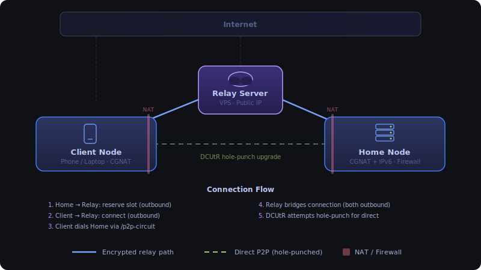

### Authentication Flow

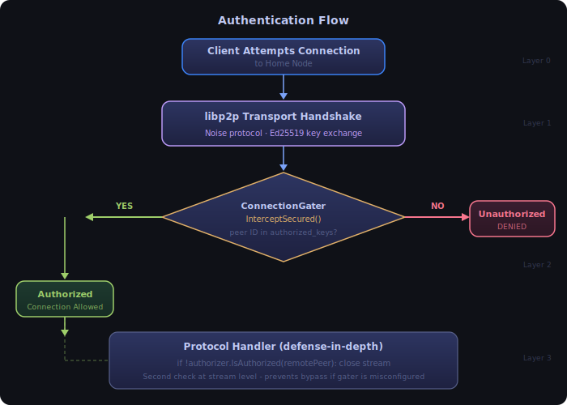

### Peer Authorization Methods

There are three ways to authorize peers:

**1. CLI - `shurli auth`**
```bash
shurli auth add <peer-id> --comment "label"
shurli auth list
shurli auth remove <peer-id>
```

**2. Invite/Join flow - zero-touch mutual authorization**
```
Machine A: shurli invite --name home     # Generates invite code + QR
Machine B: shurli join <code> --name laptop  # Decodes, connects, auto-authorizes both sides
```
The invite protocol uses PAKE-secured key exchange: ephemeral X25519 DH + token-bound HKDF-SHA256 key derivation + XChaCha20-Poly1305 AEAD encryption. The relay sees only opaque encrypted bytes during pairing. Both peers add each other to `authorized_keys` and `names` config automatically. Version byte: 0x01 = PAKE-encrypted invite, 0x02 = relay pairing code. Legacy cleartext protocol was deleted (zero downgrade surface).

**3. Manual - edit `authorized_keys` file directly**
```bash
echo "12D3KooW... # home-server" >> ~/.config/shurli/authorized_keys
```

---

## Target Architecture (Phase 9C+)

### Planned Additions

Building on the current structure, future phases will add:

```
Shurli/
├── cmd/
│   ├── shurli/              # ✅ Single binary (core + plugin-injected commands)
│   └── gateway/             # 🆕 Phase 11: Multi-mode daemon (SOCKS, DNS, TUN)
│
├── pkg/p2pnet/              # ✅ Core library (importable) - transfer engine, chunking,
│   │                        #   Merkle, compression, erasure, share registry, plugin policy
│   ├── ...existing...
│   └── federation.go        # 🆕 Phase 13: Network peering
│
├── pkg/plugin/              # ✅ Plugin framework (interface, registry, supervisor)
│
├── plugins/                 # ✅ Plugin implementations
│   ├── filetransfer/        # ✅ File transfer plugin (first extraction)
│   ├── discovery/           # 🆕 Phase 9C: Service discovery
│   ├── servicetemplates/    # 🆕 Phase 9C: Ollama, vLLM templates
│   └── wakeonlan/           # 🆕 Phase 9C: Wake-on-LAN
│
├── internal/
│   ├── config/              # ✅ Configuration + self-healing (archive, commit-confirmed)
│   ├── auth/                # ✅ Authentication
│   ├── identity/            # ✅ Shared identity management
│   ├── validate/            # ✅ Input validation (service names, etc.)
│   ├── watchdog/            # ✅ Health checks + sd_notify
│   └── tun/                 # 🆕 Phase 11: TUN/TAP interface
│
└── ...existing (deploy/, tools/, configs, docs, examples)

# External repositories (separate repos, independent release cycles):
# shurlinet/shurli-sdk-python  -> PyPI (Phase 9D)
# shurlinet/shurli-sdk-swift   -> Swift Package Manager (Phase 9E)
# shurlinet/shurli-ios    -> App Store (Phase 12)
```

### Service Exposure Architecture

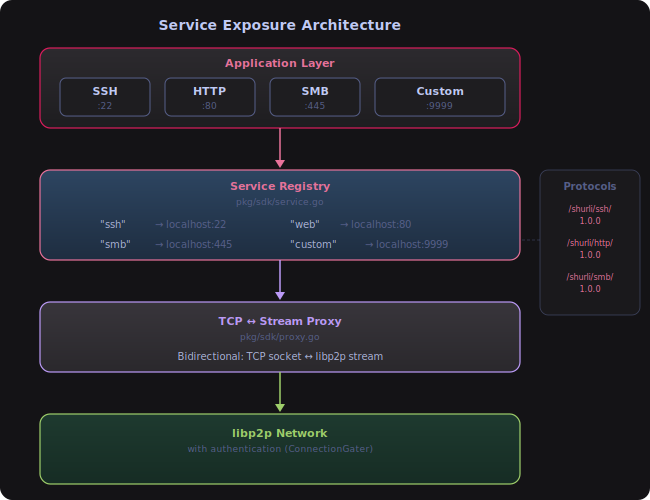

### Gateway Daemon Modes

> **Status: Planned (Phase 11)** - not yet implemented. See [Roadmap Phase 12](ROADMAP.md) for details.

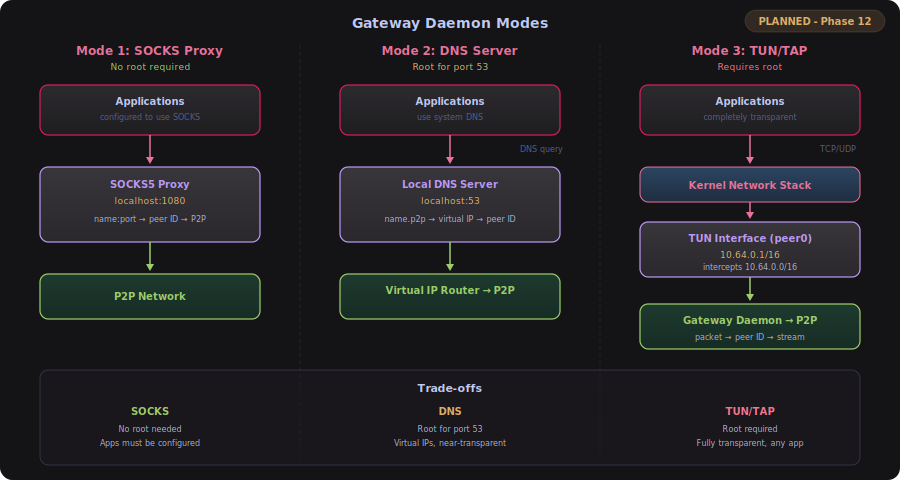

---

## Daemon Architecture

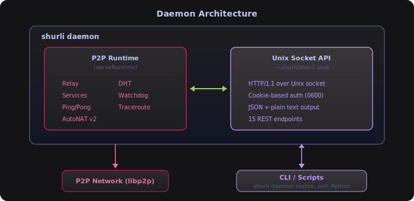

`shurli daemon` is the single command for running a P2P host. It starts the full P2P lifecycle plus a Unix domain socket API for programmatic control (zero overhead if unused - it's just a listener).

### Shared P2P Runtime

To avoid code duplication, the P2P lifecycle is extracted into `serve_common.go`:

```go
// serveRuntime holds the shared P2P lifecycle state.
type serveRuntime struct {
    network          *p2pnet.Network
    config           *config.HomeNodeConfig
    configFile       string
    gater            *auth.AuthorizedPeerGater // nil if gating disabled
    authKeys         string                    // path to authorized_keys
    ctx              context.Context
    cancel           context.CancelFunc
    version          string
    startTime        time.Time
    kdht             *dht.IpfsDHT             // peer discovery from daemon API
    ifSummary        *p2pnet.InterfaceSummary  // interface discovery (IPv4/IPv6)
    pathDialer       *p2pnet.PathDialer        // parallel dial racing
    pathTracker      *p2pnet.PathTracker       // per-peer path quality tracking
    stunProber       *p2pnet.STUNProber        // NAT type detection
    mdnsDiscovery    *p2pnet.MDNSDiscovery     // LAN discovery (nil when disabled)
    peerManager      *p2pnet.PeerManager       // background reconnection with backoff
    netIntel         *p2pnet.NetIntel          // presence protocol (nil when disabled)
    peerRelay        *p2pnet.PeerRelay         // auto-enabled with public IP
    relayDiscovery   *p2pnet.RelayDiscovery    // static + DHT relay discovery
    metrics          *p2pnet.Metrics           // nil when telemetry disabled
    bwTracker        *p2pnet.BandwidthTracker  // per-peer bandwidth stats
    relayHealth      *p2pnet.RelayHealth       // EWMA relay health scoring
    peerHistory      *reputation.PeerHistory   // per-peer interaction tracking
}
```

Methods: `newServeRuntime()`, `Bootstrap()`, `ExposeConfiguredServices()`, `SetupPingPong()`, `StartWatchdog()`, `StartStatusPrinter()`, `Shutdown()`.

### Daemon Server

The daemon server (`internal/daemon/`) is decoupled from the CLI via the `RuntimeInfo` interface:

```go
type RuntimeInfo interface {
    Network() *p2pnet.Network
    ConfigFile() string
    AuthKeysPath() string
    GaterForHotReload() GaterReloader            // nil if gating disabled
    Version() string
    StartTime() time.Time
    PingProtocolID() string
    ConnectToPeer(ctx context.Context, peerID peer.ID) error
    Interfaces() *p2pnet.InterfaceSummary        // nil before discovery
    PathTracker() *p2pnet.PathTracker             // nil before bootstrap
    STUNResult() *p2pnet.STUNResult               // nil before probe
    IsRelaying() bool                             // true if peer relay enabled
    TransferService() *p2pnet.TransferService     // file transfer service (nil if not configured)
}
```

The `serveRuntime` struct implements this interface in `cmd_daemon.go`, keeping the daemon package importable without depending on CLI code.

### Cookie-Based Authentication

Every API request requires `Authorization: Bearer <token>`. The token is a 32-byte random hex string written to `~/.config/shurli/.daemon-cookie` with `0600` permissions. This follows the Bitcoin Core / Docker pattern - no plaintext passwords in config, token rotates on restart, same-user access only.

### Stale Socket Detection

No PID files. On startup, the daemon dials the existing socket:
- Connection succeeds → another daemon is alive → return error
- Connection fails → stale socket from a crash → remove and proceed

### Unix Socket API

38 HTTP endpoints over Unix domain socket. Every endpoint supports JSON (default) and plain text (`?format=text` or `Accept: text/plain`). Full API reference in [Daemon API](DAEMON-API.md).

### Dynamic Proxy Management

The daemon tracks active TCP proxies in memory. Scripts can create proxies via `POST /v1/connect` and tear them down via `DELETE /v1/connect/{id}`. All proxies are cleaned up on daemon shutdown.

### Auth Hot-Reload

`POST /v1/auth` and `DELETE /v1/auth/{peer_id}` modify the `authorized_keys` file and immediately reload the connection gater via the `GaterReloader` interface. Access grants and revocations take effect without restart.

---

## Concurrency Model

Background goroutines follow a consistent pattern for lifecycle management:

### Ticker + Select Pattern

All recurring background tasks (relay reservation, DHT advertising, status printing, stats logging) use `time.Ticker` with `select` on `ctx.Done()`:

```go
go func() {
    ticker := time.NewTicker(interval)
    defer ticker.Stop()
    for {
        select {
        case <-ctx.Done():
            return
        case <-ticker.C:
            // do work
        }
    }
}()
```

This ensures goroutines exit cleanly when the parent context is cancelled (e.g., on Ctrl+C).

### Watchdog + sd_notify

Both `shurli daemon` and `shurli relay serve` run a watchdog goroutine (`internal/watchdog`) that performs health checks every 30 seconds:

- **shurli daemon**: Checks host has listen addresses, relay reservation is active, and Unix socket is responsive
- **shurli relay serve**: Checks host has listen addresses and protocols are registered

On success, sends `WATCHDOG=1` to systemd via the `NOTIFY_SOCKET` unix datagram socket (pure Go, no CGo). On non-systemd systems (macOS), all sd_notify calls are no-ops. `READY=1` is sent after startup completes; `STOPPING=1` on shutdown.

The systemd service uses `Type=notify` and `WatchdogSec=90` (3x the 30s check interval) so systemd will restart the process if health checks stop succeeding.

### Health Check HTTP Endpoint (`/healthz`)

The relay server optionally exposes a `/healthz` HTTP endpoint for external monitoring (Prometheus, UptimeKuma, etc.). Disabled by default in config:

```yaml
health:
  enabled: true
  listen_address: "127.0.0.1:9090"
```

The endpoint returns JSON with: `status`, `peer_id`, `version`, `uptime_seconds`, `connected_peers`, `protocols`. Bound to localhost by default - not exposed to the internet. The HTTP server starts after the relay service is up and shuts down gracefully on SIGTERM.

### Commit-Confirmed Enforcement

When a commit-confirmed is active (`shurli config apply --confirm-timeout`), `serve` starts an `EnforceCommitConfirmed` goroutine that waits for the deadline. If `shurli config confirm` is not run before the timer fires, the goroutine reverts the config and calls `os.Exit(1)`. Systemd then restarts the process with the restored config.

### Graceful Shutdown

Long-running commands (`daemon`, `proxy`, `relay serve`) handle `SIGINT`/`SIGTERM` by calling `cancel()` on their root context, which propagates to all background goroutines. The daemon also accepts shutdown requests via the API (`POST /v1/shutdown`). Deferred cleanup (`net.Close()`, `listener.Close()`, socket/cookie removal) runs after goroutines stop.

### Atomic Counters

Shared counters accessed by concurrent goroutines (e.g., bootstrap peer count) use `atomic.Int32` instead of bare `int` to prevent data races.

### Observability (Batch H)

> **Status: Implemented** - opt-in Prometheus metrics + structured audit logging.


All observability features are disabled by default and opt-in via config:

```yaml
telemetry:
  metrics:
    enabled: true
    listen_address: "127.0.0.1:9091"
  audit:
    enabled: true
```

**Prometheus Metrics** (`pkg/p2pnet/metrics.go`): Uses an isolated `prometheus.Registry` (not the global default) for testability and collision-free operation. When enabled, `libp2p.PrometheusRegisterer(reg)` exposes all built-in libp2p metrics (swarm, holepunch, autonat, rcmgr, relay) alongside custom shurli metrics. When disabled, `libp2p.DisableMetrics()` is called for zero CPU overhead.

Custom shurli metrics (50 total):
- `shurli_proxy_bytes_total{direction, service}` - bytes transferred through proxy
- `shurli_proxy_connections_total{service}` - proxy connections established
- `shurli_proxy_active_connections{service}` - currently active proxy sessions
- `shurli_proxy_duration_seconds{service}` - proxy session duration
- `shurli_auth_decisions_total{decision}` - auth allow/deny counts
- `shurli_holepunch_total{result}` - hole punch success/failure
- `shurli_holepunch_duration_seconds{result}` - hole punch timing
- `shurli_daemon_requests_total{method, path, status}` - API request counts
- `shurli_daemon_request_duration_seconds{method, path, status}` - API latency
- `shurli_path_dial_total{path_type, result}` - path dial attempts
- `shurli_path_dial_duration_seconds{path_type}` - path dial timing
- `shurli_connected_peers{path_type, transport, ip_version}` - connected peer count
- `shurli_network_change_total{change_type}` - network interface changes
- `shurli_stun_probe_total{result}` - STUN probe results
- `shurli_mdns_discovered_total{result}` - mDNS discovery events
- `shurli_peermanager_reconnect_total{result}` - reconnection attempts
- `shurli_netintel_sent_total{result}` - presence announcements sent
- `shurli_netintel_received_total{result}` - presence announcements received
- `shurli_interface_count{ip_version}` - network interface count
- `shurli_vault_sealed` - vault seal state (1=sealed, 0=unsealed)
- `shurli_vault_seal_operations_total{trigger}` - seal/unseal transitions by trigger
- `shurli_vault_unseal_total{result}` - remote unseal attempts (success/failure/denied/blocked/locked_out/error)
- `shurli_vault_unseal_locked_peers` - peers currently in lockout or permanently blocked
- `shurli_deposit_operations_total{operation}` - invite deposit lifecycle (create/revoke/modify)
- `shurli_deposit_pending` - pending unconsumed deposits
- `shurli_pairing_total{result}` - relay-mediated pairing attempts
- `shurli_macaroon_verify_total{result}` - macaroon token verifications
- `shurli_admin_request_total{endpoint, status}` - admin socket request counts
- `shurli_admin_request_duration_seconds{endpoint}` - admin socket latency
- `shurli_info{version, go_version}` - build information
- `shurli_zkp_prove_total` - ZKP proof generation attempts
- `shurli_zkp_prove_duration_seconds` - ZKP proof generation timing
- `shurli_zkp_verify_total` - ZKP proof verification attempts
- `shurli_zkp_verify_duration_seconds` - ZKP proof verification timing
- `shurli_zkp_auth_total` - ZKP auth protocol attempts
- `shurli_zkp_tree_rebuild_total` - Merkle tree rebuild count
- `shurli_zkp_tree_rebuild_duration_seconds` - Merkle tree rebuild timing
- `shurli_zkp_tree_leaves` - current Merkle tree leaf count
- `shurli_zkp_challenges_pending` - active challenge nonces
- `shurli_zkp_range_prove_total` - range proof generation attempts
- `shurli_zkp_range_prove_duration_seconds` - range proof generation timing
- `shurli_zkp_range_verify_total` - range proof verification attempts
- `shurli_zkp_range_verify_duration_seconds` - range proof verification timing
- `shurli_zkp_anon_announcements_total` - anonymous NetIntel announcements

**Audit Logger** (`pkg/p2pnet/audit.go`): Structured JSON events via `log/slog` with an `audit` group. All methods are nil-safe (no-op when audit is disabled). Events: auth decisions, service ACL denials, daemon API access, auth changes.

**Daemon Middleware** (`internal/daemon/middleware.go`): Wraps the HTTP handler chain (outside auth middleware) to capture request timing and status codes. Path parameters are sanitized (e.g., `/v1/auth/12D3KooW...` becomes `/v1/auth/:id`) to prevent high cardinality in metrics labels.

**Auth Decision Callback**: Uses a callback pattern (`auth.AuthDecisionFunc`) to decouple `internal/auth` from `pkg/p2pnet`, avoiding circular imports. The callback is wired in `serve_common.go` to feed both metrics counters and audit events.

**Relay Metrics**: When both health and metrics are enabled on the relay, `/metrics` is added to the existing `/healthz` HTTP mux. When only metrics is enabled, a dedicated HTTP server is started.

**Grafana Dashboard**: A pre-built dashboard (`grafana/shurli-dashboard.json`) ships with the project. Import it into any Grafana instance to visualize proxy throughput, auth decisions, vault unseal attempts, hole punch success rates, API latency, ZKP operations, and system metrics. 56 panels (45 visualizations + 11 row headers) across 11 sections: Overview, Proxy Throughput, Security, Hole Punch, Daemon API, System, ZKP Privacy, ZKP Auth Overview, ZKP Proof Generation, ZKP Verification, and ZKP Tree Operations.

**Reference**: `pkg/p2pnet/metrics.go`, `pkg/p2pnet/audit.go`, `internal/daemon/middleware.go`, `cmd/shurli/serve_common.go`, `grafana/shurli-dashboard.json`

### Adaptive Path Selection (Batch I)

> **Status: Implemented** - interface discovery, parallel dial racing, path tracking, network change monitoring, STUN probing, every-peer-is-a-relay.

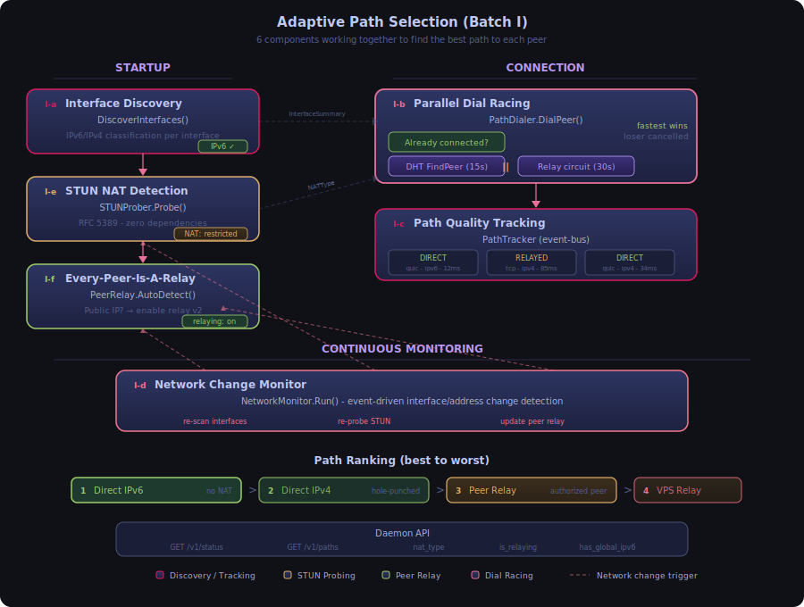

Six components work together to find and maintain the best connection path to each peer:

**Interface Discovery** (`pkg/p2pnet/interfaces.go`): `DiscoverInterfaces()` enumerates all network interfaces and classifies addresses as global IPv4, global IPv6, or loopback. Returns an `InterfaceSummary` with convenience flags (`HasGlobalIPv6`, `HasGlobalIPv4`). Called at startup and on every network change.

**Parallel Dial Racing** (`pkg/p2pnet/pathdialer.go`): `PathDialer.DialPeer()` replaces the old sequential connect (DHT 15s then relay 30s = 45s worst case) with parallel racing. If the peer is already connected, returns immediately. Otherwise fires DHT and relay strategies concurrently; first success wins, loser is cancelled. Classifies winning path as `DIRECT` or `RELAYED` based on multiaddr inspection.

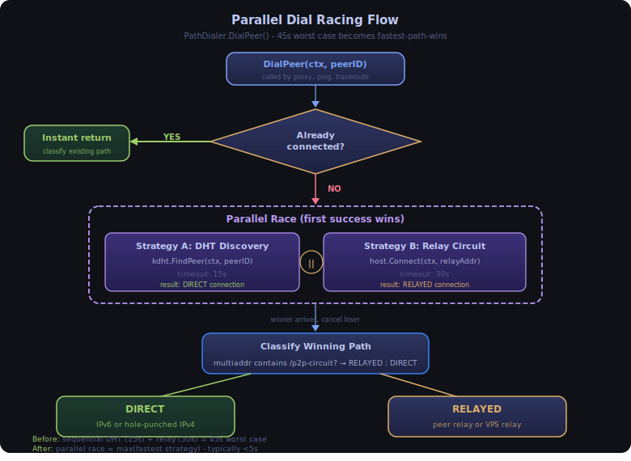

**Path Quality Tracking** (`pkg/p2pnet/pathtracker.go`): `PathTracker` subscribes to libp2p's event bus (`EvtPeerConnectednessChanged`) for connect/disconnect events. Maintains per-peer path info: path type, transport (quic/tcp), IP version, connected time, last RTT. Exposed via `GET /v1/paths` daemon API. Prometheus labels: `path_type`, `transport`, `ip_version`.

**Network Change Monitoring** (`pkg/p2pnet/netmonitor.go`, `netmonitor_darwin.go`, `netmonitor_linux.go`): Event-driven on macOS (BSD route socket) and Linux (Netlink), polling fallback on other platforms. Detects three types of changes: global IP address changes, VPN tunnel interface appearance/disappearance, and default gateway changes (private IPv4 network switches). On change, fires the full recovery chain: strip stale LAN addresses, reset black hole detectors, clear dial backoffs, close stale connections, trigger reconnect, re-browse mDNS.

**STUN NAT Detection** (`pkg/p2pnet/stunprober.go`): Zero-dependency RFC 5389 STUN client. Probes multiple STUN servers concurrently, collects external addresses, classifies NAT type (none, full-cone, address-restricted, port-restricted, symmetric). `HolePunchable()` indicates whether DCUtR hole-punching is likely to succeed. Runs in background at startup (non-blocking) and re-probes on network change.

**Every-Peer-Is-A-Relay** (`pkg/p2pnet/peerrelay.go`): Any peer with a detected global IP auto-enables circuit relay v2 with conservative resource limits (4 reservations, 16 circuits, 128KB/direction, 10min sessions). Uses the existing `ConnectionGater` for authorization (no new ACL needed). Auto-detects on startup and network changes. Disables when public IP is lost.

**Path Ranking**: direct IPv6 > direct IPv4 > STUN-punched > peer relay > VPS relay. If all paths fail, the system falls back to relay and tells the user honestly.

**Reference**: `pkg/p2pnet/interfaces.go`, `pkg/p2pnet/pathdialer.go`, `pkg/p2pnet/pathtracker.go`, `pkg/p2pnet/netmonitor.go`, `pkg/p2pnet/stunprober.go`, `pkg/p2pnet/peerrelay.go`, `cmd/shurli/serve_common.go`

### libp2p Upstream Overrides

Shurli overrides several default libp2p behaviors to handle real-world network transitions (WiFi switches, VPN activation, CGNAT migration). These are the places where Shurli's behavior diverges from stock libp2p. Check these first when debugging dial or connection issues.

| Override | Default libp2p | Shurli Behavior | File |
|----------|---------------|-----------------|------|
| TCP dialer | reuseport / sharedTcp | Source-bound `net.Dialer` (IPv6 binds to global addr) | `network.go` |
| Black hole detector | Internal, no reset API | Custom instances with `ResetBlackHoles()` on network change | `network.go` |
| Autorelay backoff | 1 hour | 30 seconds | `network.go` |
| Autorelay minInterval | 30 seconds | 5 seconds (static relays return instantly) | `network.go` |
| Autorelay boot delay | 3 minutes / 4 candidates | 0 / 1 (known static relays, no discovery phase) | `network.go` |
| Reachability | autonat (dynamic) | `ForceReachabilityPrivate` always (permanent relay fallback) | `serve_common.go` |
| Address factory | Default route interface only | `globalIPv6AddrsFactory` (all interface IPv6) | `network.go` |
| mDNS | libp2p mdns wrapper | Custom: zeroconf + native DNS-SD browse | `mdns.go` |
| Route socket (macOS) | RTM_NEWADDR / RTM_DELADDR / RTM_IFINFO | Also RTM_ADD / RTM_DELETE / RTM_CHANGE (catches WiFi hotspot switches) | `netmonitor_darwin.go` |
| Network change detection | Global IP diff only | Also: VPN tunnel interface diff + default gateway diff | `netmonitor.go`, `interfaces.go` |

**TCP source binding** (`sourceBindDialerForAddr`): When `overrideDialerForAddr` is set on libp2p's `TcpTransport`, it bypasses the default reuseport and sharedTcp dial paths entirely. Every outgoing TCP connection goes through our custom dialer function instead. For IPv4 destinations, this returns a plain `net.Dialer` (no source binding, no reuseport). For global IPv6 destinations, it returns a `net.Dialer` with `LocalAddr` set to the host's discovered global IPv6 address, forcing the kernel to route through the real network interface. Without this, macOS VPN apps (Mullvad, ExpressVPN, ProtonVPN) create utun interfaces with default IPv6 routes that persist even after the VPN disconnects. These stale routes silently capture all unbound IPv6 traffic, causing TCP connects to go through a dead tunnel and fail. Source binding overrides the kernel's route selection. The `WithDialerForAddr` option is a clean extension point in libp2p's TCP transport - 25 lines of code, no fork needed, survives library upgrades.

**Black hole detector reset**: libp2p's swarm includes a `BlackHoleSuccessCounter` for UDP and IPv6 that tracks dial success rates (default: N=100 attempts, MinSuccesses=5 required). When success rate drops below threshold, the detector enters `Blocked` state and refuses further dials of that type, allowing only 1 in N through as a probe. This is designed to avoid wasting resources on known-bad transports. The problem: after a network switch, the detector's state is stale. A switch from CGNAT (IPv6 always fails) to a WiFi network with working IPv6 leaves the detector in `Blocked` state, rejecting valid IPv6 dials. Stock libp2p provides no API to reset the detector. Shurli creates custom `BlackHoleSuccessCounter` instances via `libp2p.UDPBlackHoleSuccessCounter()` and `libp2p.IPv6BlackHoleSuccessCounter()`, stores references on the `Network` struct, and exposes `ResetBlackHoles()`. This is called from the network change callback in `serve_common.go` before any reconnection attempt.

**Autorelay tuning for static relays**: libp2p's autorelay subsystem (`p2p/host/autorelay/relay_finder.go`) is designed for DHT-discovered relay networks where candidates arrive asynchronously. Its defaults reflect this: `backoff=1h` (don't retry failed relays aggressively), `minInterval=30s` (rate-limit peer source queries), `bootDelay=3min` (wait for enough candidates before connecting), `minCandidates=4` (compare quality before selecting). For Shurli's static relay configuration (known VPS addresses, hardcoded in config), all four defaults are wrong. The peer source function returns a fixed list (zero network cost, instant return). Shurli overrides: `backoff=30s` (relay reconnection within one rsvpRefreshInterval after network change), `minInterval=5s` (peer source can be queried frequently without cost), `bootDelay=0` (no discovery phase - we know which relays we want), `minCandidates=1` (connect to the first available relay immediately). The reconnection path after a network change: `cleanupDisconnectedPeers` fires on connection loss, triggers `findNodes` to re-query the peer source, new candidates appear within 5s, `connectToRelay` dials with 10s timeout, `circuitv2.Reserve` establishes the reservation. Total: ~5-10s from relay loss to relay restored.

**ForceReachabilityPrivate**: libp2p's autonat subsystem dynamically classifies the host as "public" or "private" based on dial-back probes from other peers. When classified as "public", autorelay drops relay reservations (the reasoning: "I'm publicly reachable, I don't need a relay"). This creates a failure window on networks with public IPv6: the daemon has a global IPv6 address, autonat classifies it as public, autorelay drops the relay reservation. Then when the user switches to a CGNAT network (no public IP), autonat needs several minutes of failed probes to reclassify as "private" and re-request relay reservations. During this window, there is no relay fallback. `ForceReachabilityPrivate` forces autonat to always report "private" regardless of actual reachability. The daemon maintains relay reservations as a permanent fallback on every network, whether or not it has a public IP. The cost is one relay reservation per relay server - negligible compared to the reliability gain.

**Dial worker deduplication workaround**: libp2p's `p2p/net/swarm/dial_sync.go` creates exactly one dial worker goroutine per peer. All concurrent `DialPeer` calls to the same peer share this single worker. The worker maintains a `trackedDials` map (`dial_worker.go:215-237`) that caches dial results per address. When a dial to an address completes (success or failure), the result is stored. Subsequent `DialPeer` calls that arrive while the worker is active get the cached result from a hashmap lookup - no actual network dial occurs. After a network switch, the following race can happen: PeerManager's reconnect loop (or DHT, or autonat) dials the peer's stale LAN IPv4 address. WiFi is still settling, the dial fails with "no route to host". This error is cached in `trackedDials`. When mDNS discovers the peer on the new LAN and calls `DialPeer`, it joins the existing worker and gets the cached error instantly - never actually dials. Three-part fix: (1) `PeerManager.StripPrivateAddrs()` removes all private/LAN addresses (RFC 1918 + RFC 6598 CGNAT + ULA + loopback via `isStaleOnNetworkChange()`) from watched peers' peerstore BEFORE triggering reconnect. Without stale addresses in the peerstore, no subsystem can poison the cache. mDNS re-populates addresses from fresh multicast discovery. (2) mDNS runs a TCP readiness probe (`probeTCPReachable()` with 3s timeout, 500ms retry intervals, own context) before calling `DialPeer`. This prevents mDNS from self-poisoning the cache if WiFi is settling. (3) `scheduleRetry` (10s backup) handles probe failure on first attempt. All three parts are required: removing any one re-opens the cache poisoning window from a different subsystem.

**Network change detection**: libp2p's default network monitoring only diffs global IP address changes between snapshots. Shurli extends this with three additional detection methods, each addressing a blind spot:

1. **VPN tunnel interface detection**: Watches for interfaces matching `utun[0-9]+` (macOS: WireGuard, IKEv2, LightWay, iCloud Private Relay), `tun[0-9]+` (Linux: OpenVPN, generic), `wg[0-9]+` (WireGuard), `ppp[0-9]+` (L2TP). VPN tunnels typically carry only private IPv4 (10.x, 100.64.x), invisible to the global IP diff. When a tunnel interface appears or disappears, a network change event fires regardless of global IP changes.

2. **Default gateway tracking**: Platform-specific gateway detection (macOS: `/sbin/route -n get default`, Linux: `/sbin/ip route show default`) runs on every network change check. When the default gateway IP changes, it means the host moved to a different network even if no global IPs changed. This catches switches between two CGNAT carriers (e.g., two mobile hotspots, both private IPv4 only, no IPv6). The gateway comparison only fires when the current gateway is non-empty (suppresses intermittent lookup failures) but allows empty-to-non-empty transitions (handles daemon boot without WiFi followed by WiFi connection).

3. **Route socket expansion (macOS)**: The BSD route socket (`AF_ROUTE`) listener adds `RTM_ADD`, `RTM_DELETE`, and `RTM_CHANGE` message types alongside the original `RTM_NEWADDR`, `RTM_DELADDR`, and `RTM_IFINFO`. WiFi hotspot switches on macOS generate route table changes (default route update) but may not generate individual address events when only private IPs change on the same interface. The route change messages catch these transitions. Events are debounced (500ms after the last event) to coalesce bursts from rapid routing table updates.

---

## Core Concepts

### 1. Service Definition

Services are defined in configuration and registered at runtime:

```go
type Service struct {
    Name         string   // "ssh", "web", etc.
    Protocol     string   // "/shurli/ssh/1.0.0"
    LocalAddress string   // "localhost:22"
    Enabled      bool     // Enable/disable
}

type ServiceRegistry struct {
    services map[string]*Service
    host     host.Host
}

func (r *ServiceRegistry) RegisterService(svc *Service) error {
    // Set up stream handler for this service's protocol
    r.host.SetStreamHandler(svc.Protocol, func(s network.Stream) {
        // 1. Authorize peer
        if !r.isAuthorized(s.Conn().RemotePeer(), svc.Name) {
            s.Close()
            return
        }

        // 2. Dial local service
        localConn, err := net.Dial("tcp", svc.LocalAddress)
        if err != nil {
            s.Close()
            return
        }

        // 3. Bidirectional proxy
        go io.Copy(s, localConn)
        io.Copy(localConn, s)
    })
}
```

### 2. Bidirectional TCP↔Stream Proxy

```go
func ProxyStreamToTCP(stream network.Stream, tcpAddr string) error {
    // Connect to local TCP service
    tcpConn, err := net.Dial("tcp", tcpAddr)
    if err != nil {
        return err
    }
    defer tcpConn.Close()

    // Bidirectional copy
    errCh := make(chan error, 2)

    go func() {
        _, err := io.Copy(tcpConn, stream)
        errCh <- err
    }()

    go func() {
        _, err := io.Copy(stream, tcpConn)
        errCh <- err
    }()

    // Wait for either direction to finish
    return <-errCh
}
```

### 3. Name Resolution

**Currently implemented**: `LocalFileResolver` resolves friendly names (configured via `shurli invite`/`shurli join` or manual YAML) to peer IDs. Direct peer ID strings are always accepted as fallback.

```go
type LocalFileResolver struct {
    names map[string]peer.ID
}

func (r *LocalFileResolver) Resolve(name string) (peer.ID, error) {
    if id, ok := r.names[name]; ok {
        return id, nil
    }
    return "", ErrNotFound
}
```

> **Planned (Phase 9/14)**: The `NameResolver` interface, `DHTResolver`, multi-tier chaining, and blockchain naming are planned extensions. See [Naming System](#naming-system) below and [Roadmap Phase 14](ROADMAP.md).

---

## Security Model

### Authentication Layers

**Layer 1: Network Level (ConnectionGater)**
- Executed during connection handshake
- Blocks unauthorized peers before any data exchange
- Fastest rejection (minimal resource usage)

**Layer 2: Protocol Level (Stream Handler)**
- Defense-in-depth validation
- Per-service authorization (optional)
- Can override global authorized_keys

### Per-Service Authorization

> **Status: Implemented** (Pre-Batch H)

Each service can optionally restrict access to specific peer IDs via `allowed_peers`. When set, only listed peers can connect to that service. When omitted (nil), all globally authorized peers can access it.

```yaml
services:
  ssh:
    enabled: true
    local_address: "localhost:22"
    allowed_peers: ["12D3KooW..."]  # Only these peers can access SSH

  web:
    enabled: true
    local_address: "localhost:80"
    # No allowed_peers = all authorized peers can access
```

The ACL check runs in the stream handler before dialing the local TCP service, so rejected peers never trigger a connection to the backend.

### Role-Based Access Control (Phase 6)

> **Status: Implemented**

Three-tier access model for relay operations:

- **Tier 0 (Relay Operator)**: Unix socket access. Full control via admin endpoints.
- **Tier 1 (Network Admin)**: First peer paired with relay auto-promoted to `role=admin`. Can create/revoke invites, unseal relay remotely.
- **Tier 2 (Member)**: Standard authorized peer. Can use relay services but cannot create invites (unless invite policy is `open`).

Roles are stored as `role=admin` or `role=member` attributes in `authorized_keys`. The first peer paired with a relay is automatically promoted to admin if no admins exist.

**Reference**: `internal/auth/roles.go`, `internal/auth/manage.go`, `internal/relay/pairing.go`

### Macaroon Capability Tokens (Phase 6)

> **Status: Implemented**

HMAC-chain bearer tokens for invite permissions. Each caveat in the chain produces a new HMAC-SHA256 signature, making caveat removal cryptographically impossible.

Key properties:
- **Attenuation-only**: holders can add restrictions (caveats), never remove them
- **Offline verification**: any party with the root key can verify without network calls
- **Compact**: base64-encoded JSON, suitable for CLI and QR codes

Supported caveat types: `service`, `group`, `action`, `peers_max`, `delegate`, `expires`, `network`.

**Reference**: `internal/macaroon/macaroon.go`, `internal/macaroon/caveat.go`

### Passphrase-Sealed Vault (Phase 6)

> **Status: Implemented**

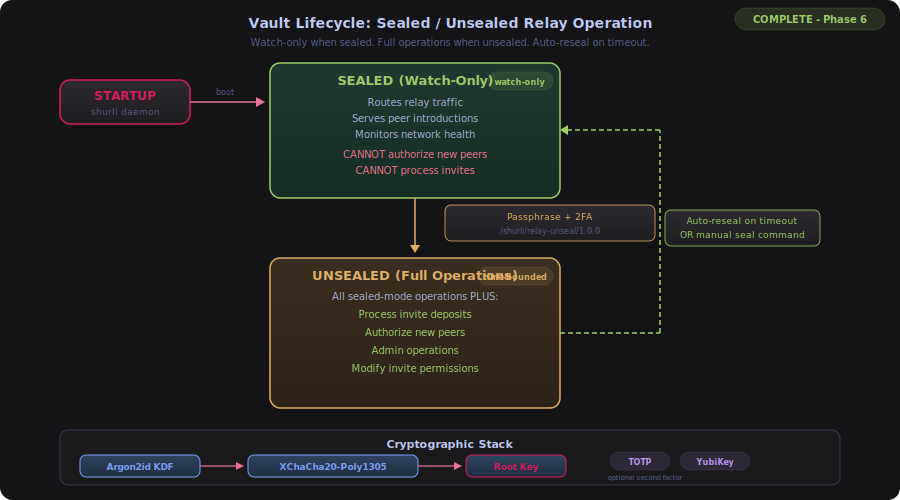

The relay's root key material (used for macaroon minting) is protected by a passphrase-sealed vault. Two operational modes:

**Sealed (default after restart)**:
- Routes circuit relay traffic for existing peers
- Serves existing peer introductions
- Cannot authorize new peers or process invite deposits

**Unsealed (time-bounded)**:
- All sealed-mode operations plus new peer authorization
- Processes invite deposits and join requests
- Auto-reseals after configurable timeout

**Crypto stack**:
- KDF: Argon2id (time=3, memory=64MB, threads=4, keyLen=32)
- Encryption: XChaCha20-Poly1305
- 2FA: TOTP (RFC 6238) and/or Yubikey HMAC-SHA1

**Seed recovery**: hex-encoded 32-byte root key (24 words). Reconstructs vault with new passphrase.

**Remote unseal**: `/shurli/relay-unseal/1.0.0` P2P protocol. Admin-only (role check), iOS-style escalating lockout (4 free attempts, then 1m/5m/15m/1h, permanent block). Prometheus metrics: `shurli_vault_sealed`, `shurli_vault_seal_operations_total{trigger}`, `shurli_vault_unseal_total{result}`, `shurli_vault_unseal_locked_peers`.

**Reference**: `internal/vault/vault.go`, `internal/relay/unseal.go`, `internal/totp/totp.go`, `internal/yubikey/challenge.go`

### Async Invite Deposits (Phase 6)

> **Status: Implemented**

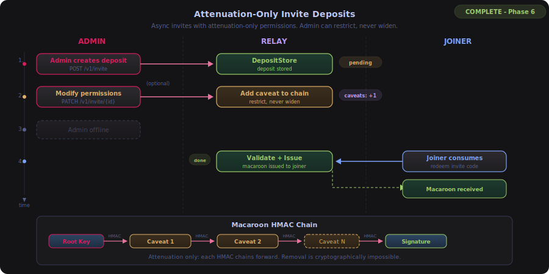

Client-deposit invites ("contact card" model). Admin creates an invite deposit on the relay and walks away. The joining peer consumes it later, without the admin needing to be online.

**Attenuation-only model**: the invite code is the authentication (immutable token). Permissions are mutable caveats on the deposit macaroon. Admins can restrict or revoke before consumption, but can never widen permissions (HMAC chain enforces this cryptographically).

Deposit states: `pending` -> `consumed` | `revoked` | `expired`

**Relay admin endpoints**: `POST /v1/invite` (create), `GET /v1/invite` (list), `DELETE /v1/invite/{id}` (revoke), `PATCH /v1/invite/{id}` (add caveats), `POST /v1/auth/reload` (hot-reload authorized_keys + ZKP tree). See also [Anonymous Relay Authorization (Phase 7)](#anonymous-relay-authorization-phase-7) for ZKP endpoints: `POST /v1/zkp/tree-rebuild`, `GET /v1/zkp/tree-info`, `GET /v1/zkp/proving-key`, `GET /v1/zkp/verifying-key`.

**Reference**: `internal/deposit/store.go`, `cmd/shurli/cmd_relay_invite.go`

### ZKP Privacy Layer (Phase 7)

> **Status: Implemented**

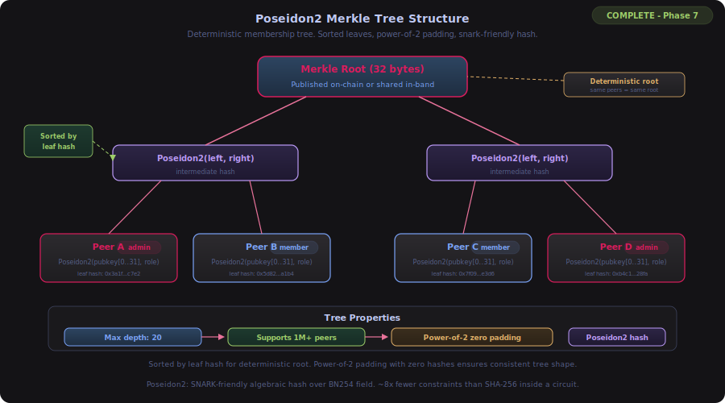

Zero-knowledge proof system for anonymous authentication. Peers prove "I'm in the authorized set" without the relay learning which peer they are. Built on gnark v0.14.0 PLONK with BN254 curve.

**Core primitive**: A Poseidon2 Merkle tree of authorized peer keys. Each leaf is `Poseidon2(ed25519_pubkey[0..31], role_encoding, score)` - 34 field elements. Leaves sorted by hash, padded to next power of 2, max depth 20 (supports 1M+ peers).

**Membership circuit** (22,784 SCS constraints):
- Public inputs: MerkleRoot, Nonce (replay protection), RoleRequired
- Private inputs: PubKeyBytes[32], RoleEncoding, Score, Path[20], PathBits[20]
- Constraints: Poseidon2 leaf hash (34 elements), 20-level Merkle path walk, root assertion, conditional role check, nonce binding
- 520-byte proofs, ~1.8s prove, ~2-3ms verify

**Key management**: Proving key (~2 MB) and verifying key (~33.5 KB) cached to disk. Circuit recompiled on demand (~70ms) - gnark's CCS CBOR deserialization panics on Go 1.26, so serialization is deliberately avoided.

**Dependencies**: gnark v0.14.0, gnark-crypto v0.19.0 (pure Go, no CGo).

**Reference**: `internal/zkp/poseidon2.go`, `internal/zkp/merkle.go`, `internal/zkp/membership.go`, `internal/zkp/prover.go`, `internal/zkp/verifier.go`, `internal/zkp/keys.go`, `internal/zkp/srs.go`

### Anonymous Relay Authorization (Phase 7)

> **Status: Implemented**

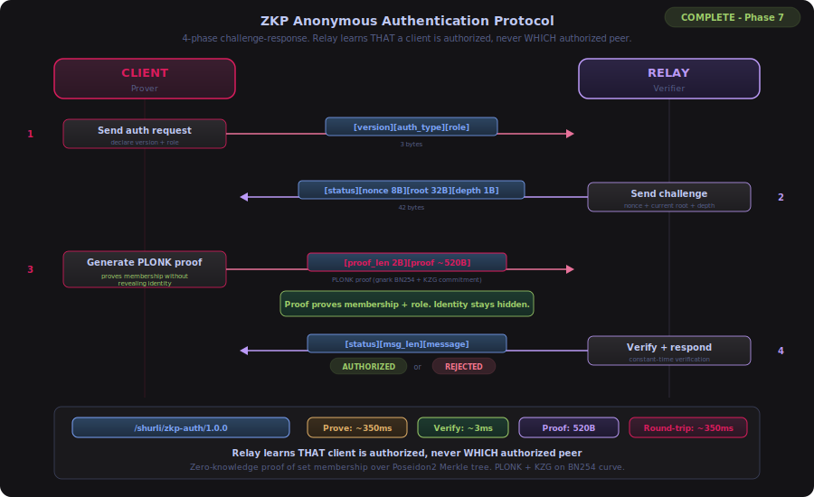

Challenge-response protocol for anonymous relay authentication. Binary wire format on libp2p streams.

**Protocol**: `/shurli/zkp-auth/1.0.0`

```
CLIENT -> RELAY:  [1 version] [1 auth_type] [1 role_required]     (3 bytes)
RELAY  -> CLIENT: [1 status] [8 nonce BE] [32 root] [1 depth]     (42 bytes)
CLIENT -> RELAY:  [2 BE proof_len] [N proof_bytes]                 (~522 bytes)
RELAY  -> CLIENT: [1 status] [1 msg_len] [N message]               (variable)
```

Auth types: `0x01` membership (any authorized peer), `0x02` role (specific role). Nonces are cryptographically random uint64, single-use, 30-second TTL.

**Admin endpoints** (relay Unix socket):
- `POST /v1/zkp/tree-rebuild` - rebuild Merkle tree from authorized_keys (vault-gated)
- `GET /v1/zkp/tree-info` - current tree state (always available)
- `GET /v1/zkp/proving-key` - download proving key binary (~2 MB)
- `GET /v1/zkp/verifying-key` - download verifying key binary (~34 KB)

**Prometheus metrics** (9 new): `shurli_zkp_prove_total`, `shurli_zkp_prove_duration_seconds`, `shurli_zkp_verify_total`, `shurli_zkp_verify_duration_seconds`, `shurli_zkp_auth_total`, `shurli_zkp_tree_rebuild_total`, `shurli_zkp_tree_rebuild_duration_seconds`, `shurli_zkp_tree_leaves`, `shurli_zkp_challenges_pending`.

**Reference**: `internal/relay/zkp_auth.go`, `internal/relay/zkp_client.go`, `internal/zkp/challenge.go`

### Private Reputation (Phase 7)

> **Status: Implemented**

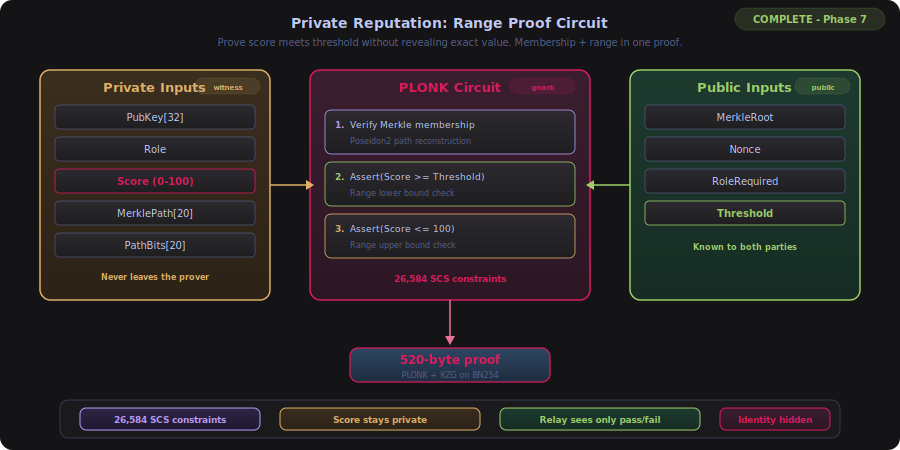

Range proofs on peer reputation scores. Prove "my score is above threshold X" without revealing the exact score.

**Scoring formula** (`ComputeScore` returns 0-100, four equally-weighted components):
- Availability (0-25): ConnectionCount / maxConnections, linear
- Latency (0-25): logarithmic decay from 10ms (25) to 5000ms (0)
- PathDiversity (0-25): 0 types=0, 1=8, 2=16, 3+=25
- Tenure (0-25): days since FirstSeen / 365, capped at 1.0

**Range proof circuit** (27,004 SCS constraints):
- Extends membership circuit with `Score` (private, committed in leaf) and `Threshold` (public)
- Additional constraints: `Score >= Threshold`, `Score <= 100`
- Same 520-byte proofs, separate PLONK keys

**Trust model**: Score is committed in the Merkle tree leaf hash alongside pubkey and role. The range proof circuit verifies the same score value used in the leaf hash, preventing inflation.

**Anonymous NetIntel**: `NodeAnnouncement` has `AnonymousMode bool` and `ZKPProof []byte` fields. When anonymous, `From` is empty, proof substitutes for identity.

**Prometheus metrics** (5 new): `shurli_zkp_range_prove_total`, `shurli_zkp_range_prove_duration_seconds`, `shurli_zkp_range_verify_total`, `shurli_zkp_range_verify_duration_seconds`, `shurli_zkp_anon_announcements_total`.

**RLN extension point**: `RLNIdentity`, `RLNProof`, `RLNVerifier` interface defined (types only, no circuit). Composable with existing membership proof for future anonymous rate limiting.

**Reference**: `internal/reputation/score.go`, `internal/zkp/range_proof.go`, `internal/zkp/rln_seam.go`, `pkg/p2pnet/netintel.go`

### BIP39 Key Management (Phase 7)

> **Status: Implemented**

Deterministic PLONK key generation from BIP39 seed phrases. One seed per node. Seeds never stored on disk.

**Flow**: `SHA256(mnemonic)` -> gnark `WithToxicSeed` -> deterministic SRS -> same proving/verifying keys on any machine.

**CLI**: `shurli relay zkp-setup` generates a 24-word BIP39 mnemonic, derives SRS, saves proving key and verifying key. `--seed` flag accepts existing mnemonic for deterministic reproduction.

**Key distribution**: Clients download proving key and verifying key from relay via `GET /v1/zkp/proving-key` and `GET /v1/zkp/verifying-key`. No seed sharing between nodes.

**Reference**: `internal/zkp/bip39.go`, `internal/zkp/srs.go`, `cmd/shurli/cmd_relay_zkp.go`

### Unified Seed Architecture (Phase 8)

> **Status: Implemented**

ONE BIP39 seed phrase (24 words) derives all cryptographic material via HKDF domain separation. Same construction as Bitcoin HD wallets.

```
BIP39 Seed (24 words)           <-- ONE backup. Paper. Offline.
    |
    |-- HKDF(seed, "shurli/identity/v1")  --> Ed25519 private key --> Peer ID
    |                                          (encrypted with password on disk)
    |
    |-- HKDF(seed, "shurli/vault/v1")     --> Vault root key (relay only)
    |                                          (encrypted with vault password)
    |
    `-- SRS derivation from seed           --> ZKP proving/verifying keys (relay only)
                                               (cached as .bin files)
```

**Security properties**: Identity key and vault key are cryptographically independent (different HKDF domains). Only the seed can derive all key types. Seed is never stored on disk.

**CLI**: `shurli init` generates seed, confirms via quiz, derives identity. `shurli recover` reconstructs from seed. `shurli recover --relay` also recovers vault + ZKP keys.

**Reference**: `internal/identity/seed.go`

### Encrypted Identity (Phase 8)

> **Status: Implemented**

All nodes (not just relays) encrypt their identity key at rest using the SHRL format:

- **KDF**: Argon2id (time=1, memory=64MB, threads=4)
- **Cipher**: XChaCha20-Poly1305 (24-byte nonce)
- **File format**: SHRL magic header + version + Argon2id salt + nonce + ciphertext

The key is decrypted at daemon startup with the node password. Raw (unencrypted) identity.key files from older installations are detected and the user is prompted to encrypt.

**CLI**: `shurli change-password` re-encrypts with a new password. Session tokens allow password-free restarts.

**Reference**: `internal/identity/encrypted.go`

### Remote Admin Protocol (Phase 8)

> **Status: Implemented**

Full relay management over encrypted P2P connections using `/shurli/relay-admin/1.0.0`. All 28 relay admin API endpoints (pairing, vault, invites, ZKP, MOTD, goodbye) are accessible remotely from any admin peer.

**Wire format**: JSON-over-stream with request/response framing. The remote admin handler adapts P2P stream requests into HTTP requests against the local admin socket, then streams responses back.

**Security**: Admin role check at stream open (non-admins rejected before any data). Rate limiting (5 requests/second per peer). Same auth model as the local Unix socket.

**CLI**: All relay admin commands support `--remote <addr>` to operate remotely instead of through the local Unix socket. The `relayAdminClientOrRemote()` helper transparently selects the transport.

**Reference**: `internal/relay/remote_admin.go`, `internal/relay/remote_admin_client.go`, `internal/relay/admin_api.go`

### MOTD and Goodbye (Phase 8)

> **Status: Implemented**

Signed operator announcements using the `/shurli/relay-motd/1.0.0` protocol.

**Message types**:
- **MOTD** (0x01): Short message shown to peers on connect. 280-char limit. Deduped per-relay (24h).
- **Goodbye** (0x02): Persistent farewell pushed to all connected peers immediately. Cached by clients, survives restarts. Used for planned relay decommission.
- **Retract** (0x03): Cancels a goodbye (relay is back).

**Wire format**: `[1 version][1 type][2 BE msg-len][N msg][8 BE timestamp][Ed25519 signature]`

**Security**: All messages signed by the relay's Ed25519 identity key. Clients verify signatures before displaying. Messages sanitized by `SanitizeRelayMessage()`: URL stripping, email stripping, non-ASCII removal, 280-char truncation. Defense against prompt injection and phishing.

**Goodbye lifecycle**: `relay goodbye set` pushes to all peers. `relay goodbye retract` clears cached goodbyes. `relay goodbye shutdown` sends goodbye then triggers graceful relay shutdown with 2s delay for message delivery.

**Reference**: `internal/relay/motd.go`, `internal/relay/motd_client.go`, `internal/validate/relay_message.go`

### Session Tokens (Phase 8)

> **Status: Implemented**

Machine-bound session tokens that allow password-free daemon restarts. Same model as ssh-agent: enter password once, work until the token expires or is destroyed.

**Design**: Session token encrypts the identity key with a machine-derived key. Token is bound to the machine (hostname + machine ID) so copying it to another device does not work.

**CLI**: `shurli session refresh` rotates the token. `shurli session destroy` deletes it (password required on next start). `shurli lock` / `shurli unlock` gate sensitive operations without destroying the session.

**Reference**: `internal/identity/session.go`, `cmd/shurli/cmd_lock.go`

### File Transfer (Phase 9B)

> **Status: Implemented** - extracted to `plugins/filetransfer/` as the first plugin. Protocol engine remains in `pkg/p2pnet/`. Plugin provides CLI commands, daemon handlers, and P2P protocol registration.

Chunked P2P file transfer with content-defined chunking, integrity verification, compression, erasure coding, multi-source download, parallel streams, and AirDrop-style receive permissions. Relay transport is allowed (relay-side bandwidth limits enforce conservation). Seven-layer DDoS defense protects all transfer endpoints.

**Four P2P protocols**:

| Protocol | Purpose |
|----------|---------|
| `/shurli/file-transfer/2.0.0` | Core send/receive with SHFT v2 wire format |
| `/shurli/file-browse/1.0.0` | Browse a peer's shared file catalog |
| `/shurli/file-download/1.0.0` | Download specific files from a share |
| `/shurli/file-multi-peer/1.0.0` | RaptorQ fountain code multi-source download |

**Wire Format (SHFT v2)**: Fixed magic bytes (`SHFT`) + version + flags + length-prefixed manifest + chunk data. Every field has max bounds enforced before parsing. Chunk hashes verified before writing to disk.

**Chunking**: Own FastCDC implementation (content-defined chunking). Adaptive target sizes from 128KB to 2MB based on file size. Single-pass chunking with BLAKE3 hash per chunk.

**Integrity**: BLAKE3 Merkle tree over all chunk hashes. Binary tree with odd-node promotion. Root hash verified after all chunks received. Chunk-level verification prevents partial corruption.

**Compression**: zstd compression on by default, auto-detects incompressible data (skips re-compression). Bomb protection: decompression aborted if output exceeds 10x compressed size. Opt-out via `transfer.compress: false`.

**Erasure Coding**: Reed-Solomon erasure coding with stripe-based layout. Auto-enabled on Direct WAN connections only (overhead not justified on LAN). Parity chunk count bounded at 50% overhead maximum. Configurable via `transfer.erasure_overhead`.

**RaptorQ Multi-Source**: Fountain codes for downloading from multiple peers simultaneously. Each peer contributes RaptorQ symbols; any sufficient subset reconstructs the file. Per-peer contribution tracking detects garbage symbols. Symbol count validated against file size. `shurli download --multi-peer --peers home,laptop`.

**Parallel Streams**: Adaptive parallel QUIC streams per transfer. Defaults: 1 stream on LAN (already fast), up to 4 on WAN. Configurable via `transfer.parallel_streams`.

**Receive Modes** (AirDrop-style, configurable via `transfer.receive_mode`):

| Mode | Behavior |
|------|----------|
| `off` | Reject all incoming transfers |
| `contacts` | Auto-accept from authorized peers (default) |
| `ask` | Queue for manual approval via `shurli accept`/`shurli reject` |
| `open` | Accept from any authorized peer without prompting |
| `timed` | Temporarily open, reverts to previous mode after duration |

**Transfer Queue**: Priority-ordered outbound queue with configurable concurrency limit (default: 3 active). `TransferQueue` manages pending/active/completed states. Priority flag via `shurli send --priority`.

**Share Registry**: Persistent file sharing via `ShareRegistry`. `shurli share add <path> [--to peer]` registers files for browsing and download by authorized peers. Shares survive daemon restarts (persisted to `~/.config/shurli/shares.json`). Selective sharing: restrict individual shares to specific peers via `--to`.

**Directory Transfer**: Recursive directory transfer with path structure preserved. `shurli send ./folder peer`. Relative paths sanitized (strip `..`, absolute paths, null bytes, control chars). Regular files only (no device files, pipes, sockets).

**Resume**: Checkpoint files (`.shurli-ckpt-<hash>`) store a bitfield of received chunks. Matched by BLAKE3 Merkle root hash. Cleaned up on successful completion. Interrupted transfers resume from the last checkpoint.

**Rate Limiting**: Fixed-window rate limiter - 10 transfer requests per minute per peer. Silent rejection (no information leakage to non-friends). Applied to both single-peer and multi-peer request paths.

**Transfer Logging**: `TransferLogger` writes JSON-line events to `~/.config/shurli/transfers.log`. File rotation at configurable size (default 10MB). Events: send, receive, accept, reject, cancel, complete, fail.

**Notifications**: `TransferNotifier` supports two modes: `desktop` (OS-native notifications) and `command` (execute a shell command template with `{from}`, `{file}`, `{size}` placeholders). Configurable via `transfer.notify_mode` and `transfer.notify_command`.

**Plugin Policy**: `PluginPolicy` enforces transport restrictions on file transfer. Default: `TransportLAN | TransportDirect | TransportRelay`. Relay transport requires `relay_data=true` on the relay's authorized keys for at least one peer in the circuit. Per-plugin peer allow/deny lists. Applied before any transfer operation.

**DDoS Defense** (7 layers): Browse rate limit (10/min/peer), global inbound rate (30/min), per-peer queue depth (10 max), failure backoff (3 fails = 60s block), min speed enforcement (10 KB/s for 30s), temp file budget, bandwidth budget per peer. All rejections are silent. All thresholds configurable.

**Queue Persistence**: Outbound queue persisted with HMAC-SHA256 integrity. 24h TTL, 1000 entry limit, 0600 permissions, atomic writes. Survives daemon restarts. Per-peer outbound limit: 100 queued per peer.

**Path Privacy**: Opaque share IDs (`share-` + random hex). Browse responses use relative paths only (via `filepath.Rel()`). Download rejects absolute paths (`filepath.IsAbs()`). Directory jailing via `os.Root`. Error messages are generic (no path fragments). Unauthorized peers get silent stream reset.

**Service Discovery**: `/shurli/service-query/1.0.0` protocol. `shurli service list --peer <name>` queries remote peer's services. Returns service name + protocol only (local addresses never exposed).

**Security**:
- Path traversal: `filepath.Base()` + sanitization on every received filename. Receive directory is a jail.
- Resource exhaustion: max 3 pending transfers per peer, max 5 concurrent active, 1M chunk limit, 64MB manifest limit, 1h timeout.
- Disk space: re-checked before each chunk write (not just at accept time).
- Transfer IDs: random hex (`xfer-<12hex>`), not sequential (prevents enumeration).
- Compression bombs: zstd decompression capped at 10x ratio per chunk.
- No symlink following in share paths.

**Daemon API Endpoints** (15 new, 38 total):

| Endpoint | Purpose |
|----------|---------|
| `POST /v1/send` | Send file to peer |
| `GET /v1/transfers` | List active transfers |
| `GET /v1/transfers/history` | List completed transfers |
| `GET /v1/transfers/pending` | List pending (awaiting accept) transfers |
| `GET /v1/transfers/{id}` | Get transfer status with progress |
| `POST /v1/transfers/{id}/accept` | Accept pending transfer |
| `POST /v1/transfers/{id}/reject` | Reject pending transfer |
| `POST /v1/transfers/{id}/cancel` | Cancel active transfer |
| `GET /v1/shares` | List shared files |
| `POST /v1/shares` | Add file to shares |
| `DELETE /v1/shares` | Remove file from shares |
| `POST /v1/browse` | Browse remote peer's shares |
| `POST /v1/download` | Download file from peer's shares |
| `POST /v1/config/reload` | Hot-reload configuration |
| `GET /v1/config/reload` | Get reload status |

**CLI Commands** (9, provided by file transfer plugin):

| Command | Description |
|---------|-------------|
| `shurli send <file> <peer>` | Send file (fire-and-forget, `--follow` for progress, `--priority`) |
| `shurli download <file> <peer>` | Download from shared catalog (`--multi-peer`, `--peers`) |
| `shurli share add/remove/list` | Manage shared files (`--to` for selective sharing) |
| `shurli browse <peer>` | Browse peer's shared files |
| `shurli transfers` | Transfer inbox (`--watch`, `--history`, `--json`) |
| `shurli accept <id>` | Accept pending transfer (`--all` for batch) |
| `shurli reject <id>` | Reject pending transfer (`--all` for batch) |
| `shurli cancel <id>` | Cancel outbound transfer |

**Dependencies**:

| Library | License | Purpose |
|---------|---------|---------|
| zeebo/blake3 | CC0 (Public Domain) | Per-chunk hash + Merkle tree |
| klauspost/compress/zstd | BSD 3-Clause | Streaming compression |
| klauspost/reedsolomon | MIT | Erasure coding |
| xssnick/raptorq | MIT | Fountain codes (multi-source) |

**Reference**: `pkg/p2pnet/transfer.go`, `pkg/p2pnet/chunker.go`, `pkg/p2pnet/merkle.go`, `pkg/p2pnet/compress.go`, `pkg/p2pnet/share.go`, `pkg/p2pnet/transfer_erasure.go`, `pkg/p2pnet/transfer_multipeer.go`, `pkg/p2pnet/transfer_raptorq.go`, `pkg/p2pnet/transfer_parallel.go`, `pkg/p2pnet/transfer_resume.go`, `pkg/p2pnet/transfer_log.go`, `pkg/p2pnet/transfer_notify.go`, `pkg/p2pnet/plugin_policy.go`

### Plugin System

Shurli uses a compiled-in plugin architecture (Layer 1) that cleanly separates core infrastructure from extensible features. Every future feature follows the plugin pattern.

**Plugin Interface**:
```go
type Plugin interface {
    Name() string
    Version() string
    Init(ctx PluginContext) error    // receives capability-granted context
    Start() error                    // register protocols, start background work
    Stop() error                     // clean shutdown
    Commands() []Command             // CLI commands this plugin provides
    Routes() []Route                 // daemon HTTP endpoints
    Protocols() []Protocol           // P2P stream handlers
    ConfigSection() string           // YAML key this plugin owns
}
```

**Lifecycle State Machine**: LOADING -> READY -> ACTIVE -> DRAINING -> STOPPED. Stream handling only in ACTIVE state. Invalid transitions rejected.

**PluginContext**: Capability-granted access to network operations. No raw Network/Host access. No credential access (daemon keys, auth cookies, vault are isolated). Structured error codes only (never raw strings).

**Supervisor**: Auto-restart crashed plugins with circuit breaker. 3 crashes within window = auto-disable. Prevents cascading failures.

**Hot Reload**: `shurli plugin enable/disable <name>` toggles plugins without daemon restart. Commands, routes, and protocols register/unregister atomically.

**Kill Switch**: `shurli plugin disable-all` immediately stops all plugins. Essential for incident response.

**CLI Commands**:

| Command | Description |
|---------|-------------|
| `shurli plugin list` | Show all plugins (built-in + installed) with status |
| `shurli plugin enable <name>` | Enable a disabled plugin |
| `shurli plugin disable <name>` | Disable a plugin (unregisters commands, routes, protocols) |
| `shurli plugin info <name>` | Show plugin details (version, status, commands, routes) |
| `shurli plugin disable-all` | Emergency kill switch |

**Three-Layer Evolution**:
- **Layer 1 (NOW)**: Compiled-in Go plugins. Native performance, full Go capabilities. Official plugins ship this way.
- **Layer 2 (NEXT)**: WASM via wazero. Any language (Rust, Python, JS, C). Sandboxed, cross-platform. Same `.wasm` runs on Go CLI, Swift app, Kotlin app.
- **Layer 3 (FUTURE)**: AI-driven plugin generation. Skills.md describes behavior, AI writes code, compiles to WASM. Aligns with Zero-Human Network vision.

**Security** (43-vector threat analysis):
- Credential isolation: daemon keys, auth cookies, vault NEVER accessible via PluginContext
- Plugins cannot install other plugins (propagation chain break, hard-coded)
- Plugin directory 0700 permission check at startup
- Structured error codes prevent identity/topology leakage
- Future (Layer 2): WASM namespace enforcement, fuel metering, memory caps, per-plugin resource accounting

**Reference**: `pkg/plugin/plugin.go`, `pkg/plugin/registry.go`, `pkg/plugin/supervisor.go`, `plugins/filetransfer/plugin.go`

### Federation Trust Model

> **Status: Planned (Phase 13)** - not yet implemented. See [Federation Model](#federation-model) and [Roadmap Phase 14](ROADMAP.md).

```yaml
# relay-server.yaml (planned config format)
federation:
  peers:
    - network_name: "alice"
      relay: "/ip4/.../p2p/..."
      trust_level: "full"      # Bidirectional routing

    - network_name: "bob"
      relay: "/ip4/.../p2p/..."
      trust_level: "one_way"   # Only alice → grewal, not grewal → alice
```

---

## Naming System

### Multi-Tier Resolution

> **What works today**: Tier 1 (Local Override) - friendly names configured via `shurli invite`/`join` or manual YAML - and the Direct Peer ID fallback. Tiers 2-3 (Network-Scoped, Blockchain) are planned for Phase 9/14.

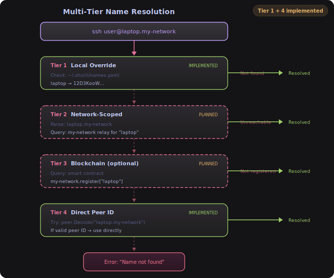

### Network-Scoped Name Format

> **Status: Planned (Phase 9/14)** - not yet implemented. Currently only simple names work (e.g., `home`, `laptop` as configured in local YAML). The dotted network format below is a future design.

```
Format: <hostname>.<network>[.<tld>]

Examples (planned):
laptop.grewal           # Query grewal relay
desktop.alice           # Query alice relay
phone.bob.p2p           # Query bob relay (explicit .p2p TLD)
home.grewal.local       # mDNS compatible
```

---

## Federation Model

> **Status: Planned (Phase 13)** - not yet implemented. See [Roadmap Phase 14](ROADMAP.md).

### Relay Peering

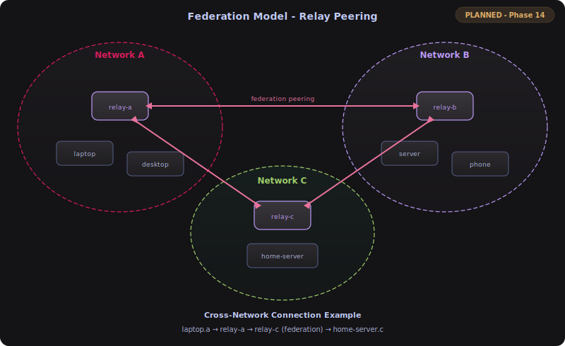

---

## Mobile Architecture

> **Status: Planned (Phase 12)** - not yet implemented. See [Roadmap Phase 13](ROADMAP.md).

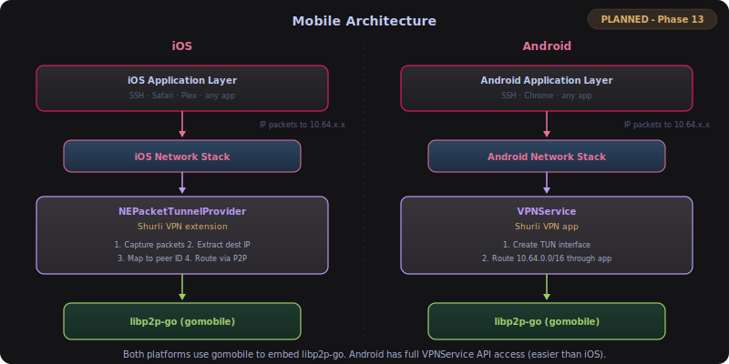

---

## Performance Considerations

### Transport Preference

Both `shurli daemon` and `shurli relay serve` register transports in this order:

1. **QUIC** (preferred) - 3 RTTs to establish, native multiplexing, better for hole-punching. libp2p's smart dialing (built into v0.47.0) ranks QUIC addresses higher than TCP.
2. **TCP** - 4 RTTs, universal fallback for networks that block UDP.
3. **WebSocket** - Anti-censorship transport that looks like HTTPS to deep packet inspection (DPI). Commented out by default in sample configs.

### AutoNAT v2

Enabled on all hosts. AutoNAT v2 performs per-address reachability testing with nonce-based dial verification. This means the node knows which specific addresses (IPv4, IPv6, QUIC, TCP) are publicly reachable, rather than a single "public or private" determination. Also prevents amplification attacks by requiring the probing peer to prove it controls the claimed address.

### Version in Identify Protocol

All hosts set `libp2p.UserAgent()` so peers can discover each other's software version via the Identify protocol:
- **shurli nodes**: `shurli/<version>` (e.g., `shurli/0.1.0` or `shurli/dev`)
- **relay server**: `relay-server/<version>`

The UserAgent is stored in each peer's peerstore under the `AgentVersion` key after the Identify handshake completes (automatically on connect).

### Connection Optimization

1. **Relay vs Direct** (implemented):
   - Always attempt DCUtR for direct connection
   - Fall back to relay if hole-punching fails

2. **Connection Pooling** (planned):
   - Reuse P2P streams for multiple requests
   - Multiplex services over single connection
   - Keep-alive mechanisms

3. **Bandwidth Management** (planned):
   - QoS for different service types
   - Rate limiting per service
   - Bandwidth monitoring and alerts

> Items marked "planned" are tracked in the [Roadmap](ROADMAP.md) under Phase 4C deferred items and Phase 13+.

### Binary Size

> **39 MB** stripped (Go 1.26, darwin/arm64, `-ldflags="-s -w" -trimpath`)


| Component | Debug Size | Why It Exists |
|-----------|-----------|---------------|
| Go FIPS 140 crypto | 32.5 MB (60%) | Go 1.24+ embeds the full FIPS-validated crypto module. Non-optional. Ed25519, AES, SHA, TLS, X.509 |
| Go runtime | 14.9 MB (28%) | GC, goroutine scheduler, memory allocator |
| gnark (ZKP) | 3.8 MB (7%) | PLONK prover/verifier, gnark-crypto field arithmetic, Poseidon2 |
| QUIC + Protobuf + DNS + Metrics | 1.9 MB (3%) | Transport, serialization, resolution, Prometheus |
| libp2p ecosystem | 1.8 MB (3%) | go-libp2p core, Kademlia DHT, yamux, routing helpers |
| WebRTC (pion) | 1.3 MB (2%) | ICE, DTLS, SCTP, SRTP for browser-compatible NAT traversal |
| **Shurli application code** | **0.4 MB (0.8%)** | **p2pnet, relay, daemon, auth, config, invite, vault, zkp, reputation, macaroon** |

~88% is Go stdlib (FIPS crypto + runtime). gnark adds 3.8 MB for the full ZKP proving system. Shurli's own code is under 1%. Every dependency serves a specific function: libp2p for P2P networking, pion for NAT traversal, gnark for zero-knowledge proofs, Prometheus for observability. Nothing to cut.

---

## Security Hardening

### Relay Resource Limits

The relay server enforces resource limits via libp2p's circuit relay v2 `WithResources()` and `WithLimit()` options. All limits are configurable in `relay-server.yaml` under the `resources:` section. Defaults are tuned for a private relay serving 2-10 peers with SSH/XRDP workloads:

| Parameter | Default | Description |
|-----------|---------|-------------|
| `max_reservations` | 128 | Total active relay slots |
| `max_circuits` | 16 | Open relay connections per peer |
| `max_reservations_per_ip` | 8 | Reservations per source IP |
| `max_reservations_per_asn` | 32 | Reservations per AS number |
| `reservation_ttl` | 1h | Reservation lifetime |
| `session_duration` | 10m | Max per-session duration |
| `session_data_limit` | 64MB | Max data per session per direction |

Session duration and data limits are raised from libp2p defaults (2min/128KB) to support real workloads (SSH, XRDP, file transfers). Zero-valued fields in config are filled with defaults at load time.

### Key File Permission Verification

Private key files are verified on load to ensure they are not readable by group or others. The shared `internal/identity` package provides `CheckKeyFilePermissions()` and `LoadOrCreateIdentity()`, used by both `shurli daemon` and `shurli relay serve`:

- **Expected**: `0600` (owner read/write only)
- **On violation**: Returns error with actionable fix: `chmod 600 <path>`
- **Windows**: Check is skipped (Windows uses ACLs, not POSIX permissions)

Keys are already created with `0600` permissions, but this check catches degradation from manual `chmod`, file copies across systems, or archive extraction.

### Config Self-Healing

The config system provides three layers of protection against bad configuration:

1. **Archive/Rollback** (`internal/config/archive.go`): On each successful `daemon` or `relay serve` startup, the validated config is archived as `.{name}.last-good.yaml` next to the original. If a future edit breaks the config, `shurli config rollback` restores it. Archive writes are atomic (write temp file + rename).

2. **Commit-Confirmed** (`internal/config/confirm.go`): For remote config changes, `shurli config apply` backs up the current config, applies the new one, and writes a pending marker with a deadline. If `shurli config confirm` is not run before the deadline, the serve process reverts the config and exits. Systemd restarts with the restored config.

3. **Validation CLI** (`shurli config validate`): Check config syntax and required fields without starting the node. Useful before restarting a remote service.

### Service Name Validation

Service names are validated before use in protocol IDs to prevent injection attacks. Names flow into `fmt.Sprintf("/shurli/%s/1.0.0", name)` - without validation, a name like `ssh/../../evil` or `foo\nbar` creates ambiguous or invalid protocol IDs.

The validation logic lives in `internal/validate/validate.go` (`validate.ServiceName()`), shared by all callers.

**Validation rules** (DNS-label format):
- 1-63 characters
- Lowercase alphanumeric and hyphens only
- Must start and end with alphanumeric character
- Regex: `^[a-z0-9]([a-z0-9-]{0,61}[a-z0-9])?$`

Validated at four points:
1. `shurli service add` - rejects bad names at CLI entry
2. `ValidateNodeConfig()` - rejects bad names in config before startup
3. `ExposeService()` - rejects bad names at service registration time
4. `ConnectToService()` - rejects bad names at connection time

---

## Security Considerations

### Threat Model

**Threats Addressed**:
- ✅ Unauthorized peer access (ConnectionGater)
- ✅ Man-in-the-middle (libp2p Noise encryption)
- ✅ Replay attacks (Noise protocol nonces)
- ✅ Relay bandwidth theft (relay authentication + resource limits)
- ✅ Relay resource exhaustion (configurable per-peer/per-IP/per-ASN limits)
- ✅ Protocol ID injection (service name validation)
- ✅ Key file permission degradation (0600 check on load)
- ✅ Newline injection in authorized_keys (sanitized comments)
- ✅ YAML injection via peer names (allowlisted characters)
- ✅ OOM via unbounded stream reads (512-byte buffer limits)
- ✅ Symlink attacks on temp files (os.CreateTemp with random suffix)
- ✅ Multiaddr injection in config (validated before writing)
- ✅ Per-service access control (AllowedPeers ACL on each service)
- ✅ Host resource exhaustion (libp2p ResourceManager with auto-scaled limits)
- ✅ SYN/UDP flood on relay (iptables rate limiting, SYN cookies, conntrack tuning)
- ✅ IP spoofing on relay (reverse path filtering via rp_filter)
- ✅ Runaway relay process (systemd cgroup limits: memory, CPU, tasks)
- ✅ Unauthorized admin operations (role-based access control + HMAC chain)
- ✅ Root key exposure at rest (Argon2id + XChaCha20-Poly1305 vault)
- ✅ Root key exposure in memory (auto-reseal timeout, explicit zeroing)
- ✅ Invite code bruteforce (8-byte deposit ID, rate limiting)
- ✅ Permission escalation on invites (HMAC chain attenuation-only, cryptographic enforcement)
- ✅ Remote unseal bruteforce (iOS-style escalating lockout: 4 free, 1m/5m/15m/1h, permanent block, admin-only)
- ✅ Relay identity correlation (ZKP membership proofs - relay cannot learn which peer authenticated)
- ✅ ZKP replay attacks (single-use nonces, 30s TTL, cryptographic randomness)
- ✅ Reputation score inflation (range proofs - prove score >= threshold without revealing exact value)
- ✅ DNS seed spoofing (DNSSEC-signed `_dnsaddr` TXT records + hardcoded fallback seeds + ConnectionGater rejects unauthorized peers post-bootstrap)
- ✅ File transfer path traversal (filepath.Base + sanitization, receive dir jail, no symlinks, regular files only)
- ✅ File transfer resource exhaustion (per-peer rate limiting, pending/active caps, chunk count limit, manifest size limit, timeout)
- ✅ File transfer disk exhaustion (disk space re-checked before each chunk write)
- ✅ Compression bombs (zstd output capped at 10x compressed size per chunk)
- ✅ Transfer ID enumeration (random hex IDs, not sequential)
- ✅ File transfer relay abuse (PluginPolicy blocks relay transport by default for transfers)
- ✅ Command injection in notifications (shell-escape all placeholder values)

**Threats NOT Addressed** (out of scope):
- ❌ Relay compromise (relay can see metadata, not content)
- ❌ Peer key compromise (users must secure private keys)

### Best Practices

1. **Key Management**:
   - Private keys: 0600 permissions
   - authorized_keys: 0600 permissions
   - Never commit keys to git

2. **Network Segmentation**:
   - Use per-service authorized_keys when needed
   - Limit service exposure (disable unused services)
   - Audit authorized_keys regularly

3. **Relay Security**:
   - Enable relay authentication in production
   - Monitor relay bandwidth usage
   - Use non-standard ports

4. **DNS Security**:
   - Enable DNSSEC on the seed domain (signs `_dnsaddr` TXT records)
   - Enable DNSSEC in your DNS provider's settings, then add the DS record at your domain registrar
   - Defense-in-depth: even without DNSSEC, the ConnectionGater rejects unauthorized peers post-bootstrap, and hardcoded seeds provide a fallback bootstrap path

---

## Scalability

### Current Limitations

- **Relay bandwidth**: Limited by VPS plan (~1TB/month)
- **Connections per relay**: Limited by file descriptors (~1000-10000)
- **DHT lookups**: Slow for large networks (10-30 seconds)

### Future Improvements

- Multiple relay failover/load balancing
- Relay-to-relay mesh for redundancy
- Optimized peer routing (shortest path)
- Distributed hash table optimization
- Connection multiplexing

---

## Technology Stack

**Core**:
- Go 1.26+
- libp2p v0.47.0 (networking)
- Private Kademlia DHT (`/shurli/kad/1.0.0` - isolated from IPFS Amino). Optional namespace isolation: `discovery.network: "my-crew"` produces `/shurli/my-crew/kad/1.0.0`, creating protocol-level separation between peer groups
- Noise protocol (encryption)
- QUIC transport (preferred - 3 RTTs vs 4 for TCP)
- AutoNAT v2 (per-address reachability testing)
- gnark v0.14.0 + gnark-crypto v0.19.0 (PLONK zero-knowledge proofs, BN254 curve, pure Go)
- zeebo/blake3 v0.2.4 (BLAKE3 hashing for chunk integrity + Merkle trees)
- klauspost/compress (zstd streaming compression)
- klauspost/reedsolomon (Reed-Solomon erasure coding)
- xssnick/raptorq (RaptorQ fountain codes for multi-source download)

**Why libp2p**: Shurli's networking foundation is the same stack used by Ethereum's consensus layer (Beacon Chain), Filecoin, and Polkadot - networks collectively securing hundreds of billions in value. When Ethereum chose a P2P stack for their most critical infrastructure, they picked libp2p. Improvements driven by these ecosystems (transport optimizations, Noise hardening, gossipsub refinements) flow back to the shared codebase. See the [FAQ comparisons](faq/comparisons.md#how-do-p2p-networking-stacks-compare) for detailed comparisons.

**Optional**:
- Ethereum (blockchain naming)
- IPFS (distributed storage)
- gomobile (iOS/Android)

---

**Last Updated**: 2026-03-20
**Architecture Version**: 6.0 (Phase 9B + Plugin Architecture Complete: Plugin Framework, File Transfer Plugin Extraction, Supervisor Auto-Restart, Security Hardening. Previous: File Transfer, FastCDC Chunking, BLAKE3 Merkle, zstd Compression, Reed-Solomon Erasure, RaptorQ Multi-Source, Parallel Streams, Share Registry, Plugin Policy)
