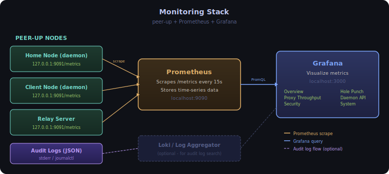

# Monitoring with Prometheus and Grafana

This guide walks you through setting up Prometheus and Grafana to visualize Shurli metrics. By the end, you'll have a live dashboard showing proxy throughput, auth decisions, hole punch stats, API latency, and system health.



## Prerequisites

- Shurli running with telemetry enabled
- Docker (recommended) or local Prometheus + Grafana installs

## Step 1: Enable telemetry in Shurli

Add this to your `shurli.yaml` (or relay config):

```yaml
telemetry:
  metrics:
    enabled: true
    listen_address: "127.0.0.1:9091"
  audit:
    enabled: true
```

Restart the daemon. Verify metrics are being served:

```bash
curl http://127.0.0.1:9091/metrics
```

You should see output starting with `# HELP` and `# TYPE` lines, followed by metric values. Both custom `shurli_*` metrics and libp2p built-in metrics (`libp2p_*`) will appear.

> **Relay server**: When both `health.enabled` and `telemetry.metrics.enabled` are set, the relay adds `/metrics` to its existing `/healthz` HTTP mux. No extra port needed.

## Step 2: Set up Prometheus

### Option A: Docker (recommended)

Create a `prometheus.yml` config file:

```yaml
global:
  scrape_interval: 15s

scrape_configs:
  - job_name: 'shurli'
    static_configs:
      - targets: ['host.docker.internal:9091']
        labels:
          instance: 'home-node'
```

> Replace `host.docker.internal` with the actual IP if not running on the same machine. Use `172.17.0.1` on Linux.

Run Prometheus:

```bash
docker run -d \
  --name prometheus \
  -p 9090:9090 \
  -v $(pwd)/prometheus.yml:/etc/prometheus/prometheus.yml \
  prom/prometheus
```

Verify at `http://localhost:9090/targets` - the shurli target should show as **UP**.

### Option B: Local install

Download from [prometheus.io/download](https://prometheus.io/download/), add the same `prometheus.yml` config, and run `./prometheus --config.file=prometheus.yml`.

### Scraping multiple nodes

Add each Shurli instance as a separate target:

```yaml
scrape_configs:
  - job_name: 'shurli'
    static_configs:
      - targets: ['10.0.1.50:9091']
        labels:
          instance: 'home-node'
      - targets: ['10.0.1.51:9091']
        labels:
          instance: 'client-node'
  - job_name: 'shurli-relay'
    static_configs:
      - targets: ['relay.example.com:9091']
        labels:
          instance: 'relay'
```

## Step 3: Set up Grafana

### Docker

```bash
docker run -d \
  --name grafana \
  -p 3000:3000 \
  grafana/grafana
```

Open `http://localhost:3000` (default login: `admin` / `admin`).

### Add Prometheus as a data source

1. Go to **Connections > Data sources > Add data source**
2. Select **Prometheus**
3. Set URL to `http://host.docker.internal:9090` (or `http://172.17.0.1:9090` on Linux)
4. Click **Save & test**

## Step 4: Import the Shurli dashboard

1. Go to **Dashboards > Import**
2. Click **Upload dashboard JSON file**
3. Select `grafana/shurli-dashboard.json` from the Shurli repository
4. Select your Prometheus data source when prompted
5. Click **Import**

You'll immediately see the dashboard with 29 panels across 6 sections.

## Dashboard sections


### Overview

Six stat panels showing the essentials at a glance:

- **Version** - which Shurli version is running
- **Uptime** - how long the daemon has been running
- **Active Proxy Connections** - current session count
- **Total Connections** - lifetime connection count
- **Total Bytes Transferred** - all proxy traffic
- **Auth Allow / Deny** - cumulative auth decisions

### Proxy Throughput

Track how your services are performing:

- **Throughput (bytes/sec)** - ingress and egress per service (ssh, xrdp, ollama, etc.)
- **Active Connections** - live gauge per service
- **Connection Rate** - new connections per second
- **Connection Duration** - p50, p95, p99 percentiles per service

### Security

Monitor access control:

- **Auth Decisions Rate** - allow/deny per second (deny spikes = something probing your node)
- **Auth Decisions (Cumulative)** - total allow vs deny count

### Hole Punch (NAT Traversal)

Understand your NAT traversal success:

- **Hole Punch Attempts** - success vs failure count over time
- **Success Rate** - gauge showing what percentage of hole punches succeed (green > 70%, orange > 50%, red < 50%)
- **Hole Punch Duration** - p50 and p95 timing (tells you how long direct connection setup takes)

### Daemon API

API health and latency:

- **Request Rate** - requests per second by endpoint path
- **Request Latency** - p50 and p95 response times by path
- **Requests by Status Code** - 200/404/500 breakdown (4xx in orange, 5xx in red)

### System

Go runtime health:

- **Memory Usage** - heap in-use, system allocated, RSS
- **Goroutines** - should be stable (a leak shows as continuous growth)
- **GC Rate** - garbage collection cycles per second
- **Open File Descriptors** - current vs max (hitting max = connection failures)
- **CPU Usage** - process CPU utilization

## Available metrics reference

### Custom shurli metrics

| Metric | Type | Labels | Description |
|--------|------|--------|-------------|
| `shurli_proxy_bytes_total` | Counter | direction, service | Bytes transferred through proxy |
| `shurli_proxy_connections_total` | Counter | service | Connections established |
| `shurli_proxy_active_connections` | Gauge | service | Currently active connections |
| `shurli_proxy_duration_seconds` | Histogram | service | Connection session duration |
| `shurli_auth_decisions_total` | Counter | decision | Auth allow/deny counts |
| `shurli_holepunch_total` | Counter | result | Hole punch success/failure |
| `shurli_holepunch_duration_seconds` | Histogram | result | Hole punch attempt duration |
| `shurli_daemon_requests_total` | Counter | method, path, status | API request counts |
| `shurli_daemon_request_duration_seconds` | Histogram | method, path, status | API request latency |
| `shurli_info` | Gauge | version, go_version | Build information |

### libp2p built-in metrics (free, no extra code)

When metrics are enabled, all libp2p instrumentation appears automatically:

- `libp2p_swarm_connections_*` - connections by transport and direction
- `libp2p_holepunch_*` - hole punch protocol events
- `libp2p_autorelay_*` - relay reservation status
- `libp2p_autonat_*` - NAT reachability detection
- `libp2p_autonatv2_*` - per-address reachability (v2)
- `libp2p_identify_*` - peer identification events
- `libp2p_rcmgr_*` - resource manager limits and usage
- `libp2p_relaysvc_*` - relay service stats (relay server only)

### Go runtime metrics

Standard Go collectors are registered automatically:

- `go_goroutines` - current goroutine count
- `go_memstats_alloc_bytes` - heap allocation
- `go_gc_duration_seconds` - GC pause times
- `process_cpu_seconds_total` - CPU usage
- `process_open_fds` / `process_max_fds` - file descriptors
- `process_resident_memory_bytes` - RSS

## Audit logging

When `telemetry.audit.enabled` is set, security events are logged as structured JSON to stderr:

```json
{"time":"2026-02-21T10:30:00Z","level":"WARN","msg":"auth_decision","audit":{"peer":"12D3KooW...","direction":"inbound","result":"deny"}}
{"time":"2026-02-21T10:30:01Z","level":"INFO","msg":"daemon_api_access","audit":{"method":"GET","path":"/v1/status","status":200}}
```

### Event types

| Event | Level | Fields | When |
|-------|-------|--------|------|
| `auth_decision` | INFO/WARN | peer, direction, result | Every inbound connection (WARN for deny) |
| `service_acl_deny` | WARN | peer, service | Peer authorized but blocked by per-service ACL |
| `daemon_api_access` | INFO | method, path, status | Every daemon API request |
| `auth_change` | INFO | action, peer | Peer added or removed via API |

### Sending audit logs to a log aggregator

Since audit events go to stderr, you can pipe them to any log collector:

**systemd journal** (default when running as a service):
```bash
journalctl -u shurli-daemon -o json | jq 'select(.MESSAGE | contains("audit"))'
```

**File output**:
```bash
shurli daemon 2> /var/log/shurli-audit.json
```

**Loki / Promtail**: Point Promtail at the journal or log file, filter on `audit` field presence.

## Docker Compose (all-in-one)

For a quick local stack with Prometheus + Grafana + Shurli metrics:

```yaml
services:
  prometheus:
    image: prom/prometheus
    ports:
      - "9090:9090"
    volumes:
      - ./prometheus.yml:/etc/prometheus/prometheus.yml
    extra_hosts:
      - "host.docker.internal:host-gateway"

  grafana:
    image: grafana/grafana
    ports:
      - "3000:3000"
    environment:
      - GF_SECURITY_ADMIN_PASSWORD=admin
    volumes:
      - grafana-data:/var/lib/grafana

volumes:
  grafana-data:
```

Start with `docker compose up -d`, then import the dashboard at `http://localhost:3000`.

## Useful PromQL queries

**Proxy throughput over last hour:**
```promql
sum(rate(shurli_proxy_bytes_total[1h])) by (service, direction)
```

**Hole punch success rate (last 24h):**
```promql
sum(shurli_holepunch_total{result="success"}) / sum(shurli_holepunch_total)
```

**Top API endpoints by latency (p95):**
```promql
histogram_quantile(0.95, sum by (le, path) (rate(shurli_daemon_request_duration_seconds_bucket[5m])))
```

**Auth deny rate (should be near zero for a healthy node):**
```promql
rate(shurli_auth_decisions_total{decision="deny"}[5m])
```

**Memory trend:**
```promql
process_resident_memory_bytes
```

## Alerting examples

If you use Grafana alerting or Alertmanager, here are useful alert rules:

```yaml
# Too many auth denials (possible scanning/attack)
- alert: HighAuthDenyRate
  expr: rate(shurli_auth_decisions_total{decision="deny"}[5m]) > 1
  for: 5m
  labels:
    severity: warning
  annotations:
    summary: "High auth denial rate on {{ $labels.instance }}"

# Hole punch success rate dropping
- alert: LowHolePunchSuccess
  expr: sum(shurli_holepunch_total{result="success"}) / sum(shurli_holepunch_total) < 0.5
  for: 15m
  labels:
    severity: warning
  annotations:
    summary: "Hole punch success rate below 50% on {{ $labels.instance }}"

# File descriptor exhaustion approaching
- alert: FileDescriptorHigh
  expr: process_open_fds / process_max_fds > 0.8
  for: 5m
  labels:
    severity: critical
  annotations:
    summary: "File descriptors at {{ $value | humanizePercentage }} on {{ $labels.instance }}"
```
