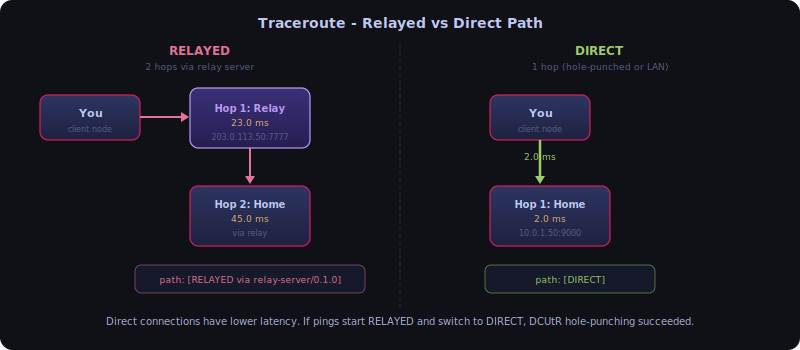

# Network Diagnostic Tools

Shurli provides P2P network diagnostic commands that mirror familiar system utilities. These route through the running daemon by default, using the daemon's managed connections for optimal path selection and zero bootstrap overhead.

## Table of Contents

- [ping](#ping)
- [traceroute](#traceroute)
- [resolve](#resolve)
- [Standalone vs Daemon](#standalone-vs-daemon)

---

## ping

P2P `ping` - measures round-trip time and connection path to a peer.

### Usage

```bash
shurli ping <peer> [-c N] [--interval 1s] [--json] [--standalone] [--config path]
```

### Behavior

| Mode | Behavior |
|------|----------|
| `-c N` (N > 0) | Send N pings, print per-ping line, summary at end |
| No `-c` flag | Continuous pinging until Ctrl+C, summary on exit |
| `--interval 1s` | Time between pings (default `1s`) |
| `--json` | JSON output (one line per ping result + final stats) |

### Output

**Plain text (default)**:

```
PING home-server (12D3KooWPrmh...):
seq=1 rtt=45.2ms path=[RELAYED]
seq=2 rtt=42.1ms path=[DIRECT]
seq=3 rtt=43.0ms path=[DIRECT]
^C
--- home-server ping statistics ---
3 sent, 3 received, 0% loss, rtt min/avg/max = 42.1/43.4/45.2 ms
```

**JSON (`--json`)**:

```json
{"seq":1,"peer_id":"12D3KooWPrmh...","rtt_ms":45.2,"path":"RELAYED"}
{"seq":2,"peer_id":"12D3KooWPrmh...","rtt_ms":42.1,"path":"DIRECT"}
{"seq":3,"peer_id":"12D3KooWPrmh...","rtt_ms":43.0,"path":"DIRECT"}
{"sent":3,"received":3,"lost":0,"loss_pct":0.0,"min_ms":42.1,"avg_ms":43.4,"max_ms":45.2}
```

### Connection Path

Each ping shows whether the connection went through the relay or directly:

| Path | Meaning |
|------|---------|
| `[DIRECT]` | Peer-to-peer (hole-punched or same LAN) |
| `[RELAYED]` | Via circuit relay server |

Direct connections have lower latency. If pings start as `RELAYED` and switch to `DIRECT`, DCUtR hole-punching succeeded.

### Ping Allow/Deny

Peers can disable ping responses in their config:

```yaml
protocols:
  ping:
    enabled: false   # silently drop ping requests
```

When disabled, the peer doesn't register the ping-pong stream handler. Pings will time out - same behavior as a firewall dropping ICMP.

### How It Works

1. Open a libp2p stream to the target peer using the ping-pong protocol (`/shurli/ping/1.0.0`)
2. Send `"ping\n"` on the stream
3. Wait for `"pong\n"` response
4. Measure round-trip time
5. Check connection type (direct vs relayed) from stream metadata

---

## traceroute

P2P `traceroute` - shows the network path to a peer with per-hop latency.

### Usage

```bash
shurli traceroute <peer> [--json] [--standalone] [--config path]
```

### Path Visualization



### Output

**Relayed connection**:

```
traceroute to home-server (12D3KooWPrmh...), max 3 hops:
 1  12D3KooWK... (relay)  203.0.113.50:7777  23.0ms
 2  12D3KooWPrmh... (home-server)  via relay  45.0ms
--- path: [RELAYED via relay-server/0.1.0] ---
```

**Direct connection**:

```
traceroute to home-server (12D3KooWPrmh...), max 3 hops:
 1  12D3KooWPrmh... (home-server)  10.0.1.50:9000  2.0ms
--- path: [DIRECT] ---
```

### What It Shows

- Whether the connection is direct or through a relay
- Latency to each hop (relay, then peer)
- Relay server's software version (from peerstore AgentVersion)
- Peer addresses

### Implementation

This is not true multi-hop tracing (libp2p doesn't support TTL). Instead, it inspects connection metadata:

1. Check if the connection to the peer goes through a relay (multiaddr contains `/p2p-circuit`)
2. If relayed: measure RTT to relay separately, then RTT to peer through relay
3. If direct: single hop with measured RTT
4. Report the agent version of intermediate nodes from the peerstore

This gives the real diagnostic information needed: **where is my traffic going, and how fast is each segment**.

---

## resolve

P2P `nslookup` - resolves peer names to peer IDs.

### Usage

```bash
# Standalone (no network needed)
shurli resolve <name> [--json] [--config path]

# Via daemon API
curl -X POST -H "Authorization: Bearer $(cat ~/.config/shurli/.daemon-cookie)" \
     -d '{"name":"home-server"}' \
     --unix-socket ~/.config/shurli/shurli.sock \
     http://localhost/v1/resolve
```

### Output

**Plain text**:

```
home-server → 12D3KooWPrmh163sTHW3mYQm7YsLsSR2wr71fPp4g6yjuGv3sGQt (source: local_config)
```

**JSON (`--json`)**:

```json
{
  "name": "home-server",
  "peer_id": "12D3KooWPrmh163sTHW3mYQm7YsLsSR2wr71fPp4g6yjuGv3sGQt",
  "source": "local_config"
}
```

### Resolution Sources

| Source | Meaning |
|--------|---------|
| `local_config` | Resolved from `names:` section in `config.yaml` |
| `peer_id` | Input was already a valid peer ID (direct parse) |

### No Network Required

`resolve` reads from local config only - it doesn't contact the network or start a P2P host. Resolution is instant.

Names are configured in `config.yaml`:

```yaml
names:
  home-server: "12D3KooWPrmh163sTHW3mYQm7YsLsSR2wr71fPp4g6yjuGv3sGQt"
  laptop: "12D3KooWNq8c1fNjXwhRoWxSXT419bumWQFoTbowCwHEa96RJRg6"
```

---

## Daemon-First Architecture

All network commands route through the running daemon by default. The daemon manages P2P connections with PeerManager, which automatically upgrades paths (relay to direct), handles mDNS LAN discovery, and recovers from network changes.

| Mode | How | Speed | Path Upgrades |
|------|-----|-------|---------------|
| Daemon (default) | Subcommand talks to daemon via Unix socket API | Instant (no bootstrap) | Yes (PeerManager) |
| Standalone | `--standalone` flag or `cli.allow_standalone` config | 5-15s bootstrap | No |

### Why Daemon-First

Standalone subcommands create their own temporary P2P host with no PeerManager, no mDNS, no IPv6 probing. If the remote peer restarts, a standalone proxy reconnects via relay and stays there, even when a direct path is available. The daemon's managed connection handles all of this automatically.

### Standalone Mode (Debug Only)

Standalone mode is disabled by default. To enable it:

**One-off** (CLI flag):
```bash
shurli ping --standalone home-server
shurli proxy --standalone home ssh 2222
shurli traceroute --standalone home-server
```

**Persistent** (config file):
```yaml
cli:
  allow_standalone: true
```

When standalone is disabled and no daemon is running, the command prints:
```
Daemon not running. Start it with:
  shurli daemon

Or use --standalone flag for direct P2P (debug):
  shurli ping --standalone home-server
```

### Shared Logic

Both modes use the same underlying functions:
- `p2pnet.PingPeer()` - streaming ping with configurable count and interval
- `p2pnet.ComputePingStats()` - min/avg/max/loss statistics
- `p2pnet.TracePeer()` - connection path analysis

### Known Limitation

Continuous ping (`shurli ping home-server` without `-c`) requires standalone mode because the daemon's HTTP API collects all results before responding and cannot stream. Use `-c N` for daemon-routed pings.

---

## System Utility Comparison

| System Tool | Shurli Equivalent | What It Does |
|-------------|-------------------|--------------|
| `ping` | `shurli ping` | Measure RTT to a peer |
| `traceroute` | `shurli traceroute` | Show path to a peer (direct vs relay) |
| `nslookup` / `dig` | `shurli resolve` | Resolve name to peer ID |
| `ss` / `netstat` | `shurli daemon peers` | Show connected peers |
| `systemctl status` | `shurli daemon status` | Show daemon status |

---

**Last Updated**: 2026-02-27
