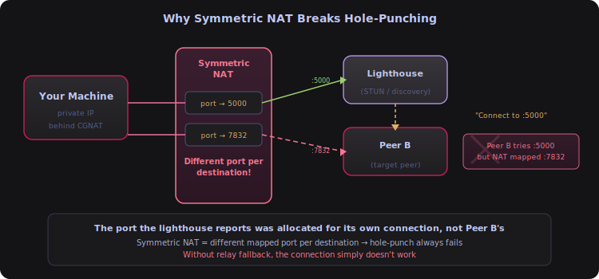
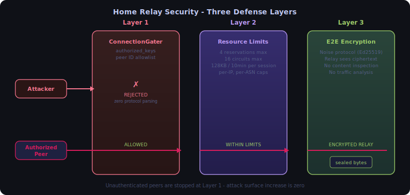
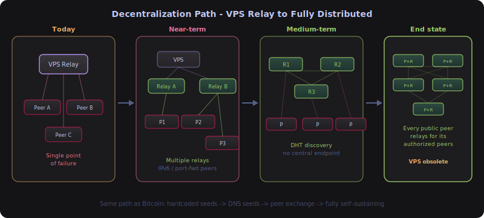

# FAQ - Relay & NAT Traversal

## What is Circuit Relay v2?

Circuit Relay v2 is libp2p's protocol for routing traffic through an intermediary relay node when peers can't connect directly (NAT, CGNAT, firewalls). It replaced v1 in 2021.

### How it works


The protocol splits into two sub-protocols:
- **Hop** (`/libp2p/circuit/relay/0.2.0/hop`) - client <-> relay (reserve, connect)
- **Stop** (`/libp2p/circuit/relay/0.2.0/stop`) - relay <-> target peer (deliver connection)

### Why v1 was replaced

v1 had no resource reservation - relays got overloaded with no way to limit usage. v2 introduced explicit reservations with configurable limits (duration, data caps, bandwidth), making it cheap to run "an army of relays for extreme horizontal scaling." Relays can reject connections with status codes like `RESOURCE_LIMIT_EXCEEDED` or `RESERVATION_REFUSED`.

### Known limitations

| Limitation | Detail |
|-----------|--------|
| **Setup latency** | 5-15 seconds (reservation + handshake + DHT lookup) |
| **No persistent connections** | Connections have hard TTL; each dial requires new reservation |
| **Reservation overhead** | Every peer must explicitly reserve before receiving relayed connections |
| **Throughput asymmetry** | Limited by relay's aggregate bandwidth, not peer bandwidth |
| **Default public limits** | 128 KB data cap, 2-minute duration (configurable on self-hosted) |

### Is there a Circuit Relay v3?

**No.** No v3 exists or is planned. libp2p's strategy is to reduce *dependence* on relays through better hole punching ([DCUtR](https://github.com/libp2p/specs/blob/master/relay/DCUtR.md) improvements, [AutoNAT v2](https://github.com/libp2p/specs/blob/master/autonat/autonat-v2.md)), not to replace the relay protocol itself.

The improvements come from upgrading everything *around* the relay - see the next FAQ entry.

**Source**: [Circuit Relay v2 Specification](https://github.com/libp2p/specs/blob/master/relay/circuit-v2.md)

---

## Why Circuit Relay v2 is the right choice for Shurli

1. **Symmetric NAT** - Hole-punch success rates are irrelevant (all protocols fail against symmetric NAT, all fall back to relay)
2. **Self-hosted relay** - You control limits, so the 128KB/2min public relay caps don't apply
3. **No vendor dependency** - Matches the self-sovereign philosophy
4. **Native to libp2p** - No additional dependencies in the Go codebase
5. **Battle-tested** - Millions of IPFS nodes use it daily
6. **Configurable** - When you run your own relay, you set your own resource limits

The only area where alternatives genuinely outperform Circuit Relay v2:
- **Connection speed**: Persistent relay services (1-3s) and vendor-operated relays (<1s) are faster than Circuit Relay v2 (5-15s) due to always-on connections
- **Hole-punch success for regular NAT**: QUIC-based P2P libraries (~90%+) and vendor-operated relays (~92%) beat DCUtR (~70%) - but this doesn't matter for symmetric NAT

For Starlink CGNAT with a self-hosted relay, Circuit Relay v2 is **functionally equivalent** to other relay approaches in relay quality.

---

## Can I use public relay servers instead of my own?

Yes, public IPFS relays exist - thousands of them. Since Circuit Relay v2, every public IPFS node runs a relay by default. libp2p's AutoRelay can discover and use them automatically.

**But there's a catch.** Public relays have strict resource limits:

| Constraint | Public IPFS relay (v2 defaults) | Your self-hosted relay |
|-----------|-------------------------------|------------|
| **Duration** | 2 minutes per connection | Unlimited (you configure) |
| **Data cap** | 128 KB per relay session | Unlimited (you configure) |
| **Bandwidth** | ~1 Kbps (intentionally throttled) | Your VPS bandwidth |
| **Purpose** | Coordinate hole-punch, then disconnect | Full traffic relay |
| **Uptime** | Random node, could disappear | Your VPS, 99.9% uptime |
| **SSH session** | Drops after 2 min or 128 KB | Works indefinitely |

Public relays are designed as a **trampoline** - they help two peers find each other, attempt a hole-punch, and then drop off. They were never meant for sustained traffic like SSH sessions, XRDP, or LLM inference.

---

## How do public relays differ from self-hosted relays?

Conceptually yes - both are "someone else's relay you use for free." But the implementation differs significantly:

| | **IPFS public relays** | **Vendor-operated persistent relays** |
|---|---|---|
| **Operator** | Thousands of random IPFS peers | A specific company or team |
| **Architecture** | Decentralized - any public node can be a relay | Centralized - vendor runs them |
| **Data limit** | 128 KB per session | No hard cap |
| **Time limit** | 2 minutes | Persistent connection |
| **Purpose** | Trampoline for hole-punch coordination | Actual traffic fallback (like vendor relay servers) |
| **Reliability** | Random node could vanish anytime | Operated infrastructure |
| **Protocol** | libp2p Circuit Relay v2 | Custom protocols (e.g., UDP-over-HTTP) |

Vendor-operated persistent relays are designed to carry real traffic when hole-punching fails. IPFS's public relays are just for the initial handshake.

---

## Why does Shurli use its own relay?

For Starlink/CGNAT (symmetric NAT) users, hole-punching **always fails**. Traffic must stay on the relay for the entire session. This means:

1. **Public IPFS relays** - Connection drops after 2 minutes or 128 KB. Unusable.
2. **Vendor-operated relays** - Would work, but you depend on a third party's infrastructure and lose sovereignty.
3. **Centralized VPN relays** - Would work, but requires an account with a centralized service and their control plane.
4. **Your own relay** - Works indefinitely, unlimited data, you control everything.

Shurli's self-hosted relay ($5/month VPS) is the only option that provides **both** unlimited traffic **and** full sovereignty.

---

## Why does symmetric NAT break hole-punching?

Some mesh overlay tools use **lighthouse nodes** (like STUN servers) to help peers discover each other's public IP:port. Then they attempt direct hole-punching.

With symmetric NAT (CGNAT), the mapped port **changes for every destination**:



The port the lighthouse tells Peer B to use was allocated for the lighthouse connection, not Peer B. The hole-punch fails.

**Tools without relay fallback simply fail.** If hole-punching fails, the connection does not work. Centralized VPN tools fall back to vendor relay servers. Shurli falls back to circuit relay. Certificate-based mesh tools without relay support have nothing.

---

## Is it safe for my home node to act as a relay?

This is the most important security question for Shurli's future. The short answer: **yes, with Circuit Relay v2's built-in protections, a home node can safely relay traffic for authorized peers without increasing its attack surface.**

Here's the full breakdown - because "trust us" is not a security argument.



### What "acting as a relay" actually means

When your home node enables relay service, it does one thing: accept a reservation from a peer (identified by their peer ID), then forward encrypted bytes between that peer and whoever connects to them through you. Your node never sees the content - it's end-to-end encrypted with Noise protocol. Your node never authenticates the remote peer's connections - that's the target peer's job.

Think of it as holding two tin cans connected by a string. You're the string. You can feel vibrations but not hear words.

### Resource limits are enforced by the protocol, not by trust

Circuit Relay v2 was specifically redesigned (from v1) because v1 relays had no resource controls and got overwhelmed. v2 has per-reservation resource budgets baked into the protocol:

| Protection | What it prevents | Default |
|-----------|-----------------|---------|
| **Max reservations** | Total peers using your relay | Configurable (128 default) |
| **Max circuits per peer** | One peer consuming all relay capacity | 16 |
| **Max reservations per IP** | IP address hoarding reservations | 8 |
| **Max reservations per ASN** | One ISP's network flooding your relay | 32 |
| **Reservation TTL** | Stale reservations consuming resources | 1 hour |
| **Session duration** | Indefinite relay connections | Configurable (10 min default) |
| **Session data limit** | Bandwidth theft | Configurable (64 MB default) |

When any limit is hit, the relay returns `RESOURCE_LIMIT_EXCEEDED` and the connection is refused. No crash, no OOM, no degradation. The peer simply can't connect.

### Only relay for people you chose

Shurli's relay service is **restricted to peers in your `authorized_keys` file** by default. The ConnectionGater blocks unauthenticated connections before any relay protocol runs - an anonymous internet scanner hitting your relay's port gets rejected at the connection layer, and the reservation request never reaches the relay service logic.

Batch I-f shipped "every-peer-is-a-relay" - any peer with a detected global IP auto-enables circuit relay v2 with conservative resource limits (4 reservations, 16 circuits, 128KB per direction, 10-minute sessions). The ConnectionGater ensures only authorized peers can make reservations or create circuits through this relay.

Relay management uses the relay admin socket (Unix domain socket with cookie auth). Admins generate pairing codes via `shurli relay pair`, which talks to the running relay process directly. No SSH needed for peer onboarding, no manual peer ID exchange.

The attack surface increase from enabling relay is **zero** for unauthenticated peers - they are rejected at the same layer they would be rejected at today.

### "But my IP address becomes visible"

This concern has two parts:

**Part 1: Visible to peers you explicitly authorized.** Yes - when a peer connects directly (via hole punch or IPv6), they see your IP. But you already authorized them in `authorized_keys`. They already know where you are conceptually. And your IP is visible in any direct TCP/QUIC connection regardless of whether relay service is enabled.

**Part 2: Visible on the public DHT.** No - Shurli uses a **private Kademlia DHT** (`/shurli/kad/1.0.0`), completely isolated from the public IPFS Amino DHT. Your node only talks to other Shurli nodes for discovery, not the broader IPFS network. Your addresses are only discoverable by peers running Shurli software. Additional mitigations:
- **Relay-only advertising**: Advertise only your relay VPS address; your home IP only visible after authentication
- **IPv6 privacy extensions**: Use temporary IPv6 addresses that rotate

The relay VPS model today already exposes its public IP. A home relay with the ConnectionGater is no more exposed than the VPS - and arguably less, since only authorized peers can connect.

### What your relay CANNOT be used for

| Attack | Why it fails |
|--------|-------------|
| **Traffic sniffing** | End-to-end Noise encryption - relay sees ciphertext only |
| **Connection injection** | Both peers authenticate each other via peer ID (Ed25519) |
| **DDoS amplification** | QUIC source address verification; per-IP reservation limits |
| **Resource exhaustion** | Hard limits on reservations, circuits, duration, data |
| **Open relay abuse** | ConnectionGater allowlist - only authorized peers can reserve |
| **Pivot to your LAN** | Relay forwards bytes, doesn't parse them. No routing to your network. |

### Why this is different from running an open service

Self-hosters know the pattern: expose a service on a home server, and within hours the port scanners find it. Firewall logs light up with probes from around the world. This happens because the service accepts connections from anyone - every participant on the network can reach it.

A Shurli relay with its ConnectionGater allowlist is fundamentally different:

| | **Typical exposed service** | **Shurli relay** |
|---|---|---|
| **Who can connect** | Anyone who finds the port | Only peers in your `authorized_keys` |
| **What they can do** | Full protocol interaction | Forward encrypted bytes (nothing else) |
| **Discovery** | Port scanning, Shodan, service-specific gossip | Private - only authorized peers know about it |
| **Attack surface** | Full protocol parser (HTTP, SSH, etc.) | ConnectionGater rejection (zero protocol parsing for unauthorized) |

An open service is an open door with a bouncer inside. A Shurli relay is a door that only opens with the right key - and even then, it only passes sealed envelopes.

### Comparison with other relay architectures

| Feature | **Shurli** | **Vendor-operated relay** | **IPFS public relay** |
|---------|------------|-------------------|---------------------|
| **Who can use it** | Explicit allowlist (authorized_keys) | Any account holder | Anyone |
| **Authentication** | ConnectionGater (peer ID) | WireGuard keys | None |
| **Resource limits** | Per-peer, per-IP, per-ASN | Not published | 128 KB / 2 min |
| **E2E encryption** | Noise (Ed25519) | WireGuard (Curve25519) | Noise |
| **Relay sees content** | No | No | No |
| **Self-hosted** | Yes | No (vendor operates) | N/A (public nodes) |

### The path forward



The ConnectionGater-protected relay model is how Shurli eliminates dependency on the central relay VPS:

1. **Today**: One relay VPS + every-peer-is-a-relay (Batch I-f) for peers with public IPs
2. **Near-term**: Home nodes with public IPv6 or port-forwarding serve as additional relays -> multiple relays across the network
3. **Medium-term**: Peers discover authorized relays via DHT (not a central endpoint) -> no single point of failure
4. **End state**: Every publicly-reachable Shurli node relays for its authorized peers -> relay VPS becomes **obsolete** (not just optional)

This follows the same decentralization path as Bitcoin: hardcoded seeds -> DNS seeds -> peer exchange -> fully self-sustaining network.

**Sources**:
- [Circuit Relay v2 Specification](https://github.com/libp2p/specs/blob/master/relay/circuit-v2.md)
- [IPFS Hole Punching Blog - Relay as Last Resort](https://blog.ipfs.tech/2022-01-20-libp2p-hole-punching/)
- [libp2p Resource Manager](https://github.com/libp2p/go-libp2p/tree/master/p2p/host/resource-manager)

---

## Can NAT traversal improve without changes to Shurli?

Yes. NAT traversal success depends heavily on what the NAT device does, and router/OS vendors are starting to make NATs friendlier.

### FreeBSD PF: Endpoint-Independent Mapping (Sep 2024)

FreeBSD's packet filter (PF) now has an `endpoint-independent` NAT option for UDP. This makes the NAT behave as "full cone" - the mapped port stays the same regardless of destination. Full-cone NATs have near-100% hole-punch success because both peers can predict each other's mapped ports.

**Why this matters**: OPNsense (a popular firewall/router OS) is FreeBSD-based. If OPNsense adopts this option, a significant number of home and SMB routers get friendlier NAT behavior - and Shurli's DCUtR success rate improves automatically without any code changes.

**What to watch**: OPNsense releases, pfSense updates, and any Linux `nftables` equivalent. If this pattern spreads to consumer routers, the percentage of "hard NAT" cases (endpoint-dependent mapping) shrinks organically.

**Source**: [FreeBSD Status Report - Endpoint-Independent Mapping NAT](https://www.freebsd.org/status/report-2024-07-2024-09/eim-nat/)

### IPv6 eliminates NAT entirely

Many ISPs now provide globally routable public IPv6 addresses. IPv6 has no NAT - every device gets a public address. When two peers both have IPv6, they connect directly with zero NAT traversal, zero hole punching, zero relay dependency.

Shurli already supports IPv6 through libp2p's transport layer. AutoNAT v2 tests IPv4 and IPv6 reachability independently, so a node behind IPv4 CGNAT but with public IPv6 will correctly identify that its IPv6 addresses are directly reachable.

**Expected impact**: As IPv6 adoption grows (currently ~49% globally, higher on mobile networks), the percentage of connections requiring relay will decrease. For networks where both peers have IPv6, relay is already unnecessary today. Shurli's Phase 5 IPv6 path probing already achieves this: cross-ISP DIRECT connections at 23ms via IPv6 when both peers have public addresses.

---

## How does CGNAT detection work?

CGNAT (Carrier-Grade NAT) is a second layer of NAT applied by mobile carriers and some ISPs. It makes hole-punching unreliable because the outer NAT drops unsolicited inbound packets regardless of inner NAT type.

Shurli detects CGNAT by checking local interfaces for RFC 6598 addresses (`100.64.0.0/10`). When found, the reachability grade is capped at D regardless of STUN results. This prevents false optimism: STUN sees only the inner NAT and might report "hole-punchable" when the outer CGNAT will actually block it.

| Detection method | What it catches | What it misses |
|-----------------|-----------------|----------------|
| RFC 6598 (`100.64.0.0/10`) on local interface | Standard CGNAT deployments | Mobile carriers using RFC 1918 (`172.x.x.x`) for CGNAT |
| `network.force_cgnat: true` in config | Any CGNAT (user-declared) | Nothing (explicit override) |
| STUN external IP differs from local IP | Any NAT layer | Can't distinguish CGNAT from regular NAT |

**For carriers using RFC 1918 addresses for CGNAT**: some mobile carriers assign addresses like `172.20.x.x` which look identical to a regular home network. Auto-detection cannot distinguish these. If you know your carrier uses CGNAT, set `force_cgnat: true` in your config:

```yaml
network:
  force_cgnat: true
```

This caps reachability at Grade D and skips hole-punch attempts that would fail through the outer carrier NAT.

The grade is honest about what it knows and what it doesn't. When CGNAT is detected (or forced), the grade says so. When it can't be detected and isn't forced, the grade reflects STUN results and the user sees the outcome in their actual connection path (direct vs relayed).

---

**Last Updated**: 2026-02-25
