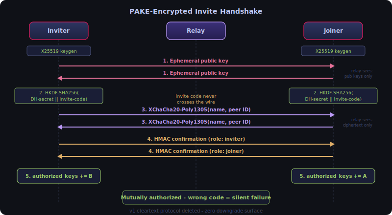
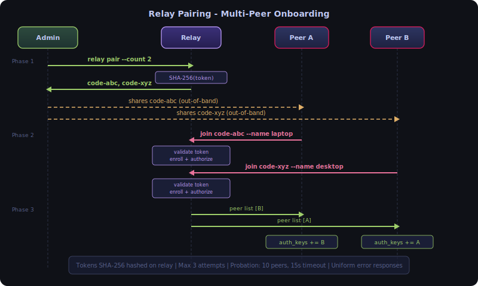
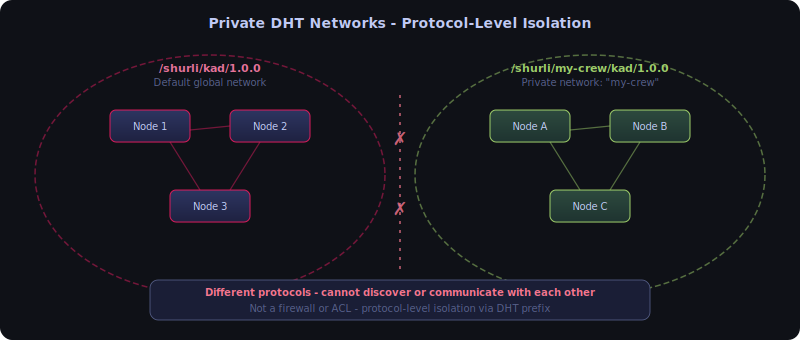

# FAQ - Security & Features

## How does the encrypted invite handshake work?

The invite/join flow uses a PAKE-inspired encrypted handshake (shipped in Pre-Batch I-b). The invite code itself is a shared secret that never travels over the wire.



1. Both sides generate ephemeral X25519 key pairs
2. They exchange public keys over the relay-mediated stream
3. Each side derives a shared AEAD key using HKDF-SHA256 with the DH shared secret and invite code combined as input keying material (info: "shurli-invite-v1")
4. All subsequent messages (peer names, peer IDs) are encrypted with XChaCha20-Poly1305
5. Key confirmation MACs verify both sides derived the same key

The relay sees only ephemeral public keys and encrypted bytes. It cannot learn the invite code, peer names, or any protocol details. If the invite codes don't match, AEAD decryption fails silently with no information leaked.

The original v1 cleartext invite protocol has been deleted. There is zero downgrade surface.

---

## How does relay pairing work?

Relay pairing is the streamlined way to onboard multiple peers to a relay. Instead of SSH-ing into the relay and manually exchanging peer IDs, the relay admin generates pairing codes and shares them.



**Relay admin:**
```bash
shurli relay pair --count 3 --ttl 1h
# Generates 3 pairing codes, each valid for 1 hour
```

**Each person joining:**
```bash
shurli join <pairing-code> --name laptop
# Connects to relay, discovers other peers, mutually authorizes everyone
```

The relay-side flow covers: token validation, enrollment mode (probationary peer admission), HMAC group commitment, peer authorization, group attribute annotation, peer discovery, and response encoding with the joined peer list.

Security properties:
- Pairing codes are hashed (SHA-256) on the relay. The relay stores the hash, not the code.
- Max 3 failed attempts per code group before all codes in the group burn.
- Probationary peers (max 10, 15s timeout) are evicted if pairing doesn't complete.
- All failure modes return a uniform "pairing failed" error (no oracle attacks).

**Comparison to invite/join**: Invite/join (`shurli invite` + `shurli join`) pairs exactly 2 peers directly with PAKE-encrypted key exchange. Relay pairing (`shurli relay pair`) onboards multiple peers to a relay-managed group. Use invite/join for peer-to-peer, relay pairing for groups.

---

## How does peer verification work?

After pairing, peers show an `[UNVERIFIED]` badge in ping, traceroute, and status output. This means the cryptographic identity hasn't been verified out-of-band.

**To verify a peer:**
```bash
shurli verify home
# Shows a 4-emoji + 6-digit numeric fingerprint
# Both sides must see the same fingerprint
# Confirm via a separate channel (phone call, in person, messaging app)
```

The fingerprint is computed from a sorted hash of both peer IDs (OMEMO-style). Once confirmed, the peer's `authorized_keys` entry gets a `verified=sha256:<prefix>` attribute and the badge changes to `[VERIFIED]`.

This is the same trust model as Signal's safety numbers or WhatsApp's security code. The emoji format makes it easy to compare verbally ("moon rocket house cat" is faster and less error-prone than reading hex digits).

**When verification matters**: If you paired via a relay code and want to confirm no MITM occurred during the relay-mediated exchange. If you paired in person or via a trusted channel, the pairing itself provides the verification.

---

## What are reachability grades?

The daemon status API (`shurli daemon status`) shows a reachability grade from A to F:

| Grade | Meaning | What it means for connections |
|-------|---------|------------------------------|
| **A** | Public IPv6 | Direct connections to anyone, no relay needed |
| **B** | Public IPv4 or hole-punchable NAT | Direct connections likely (full-cone or address-restricted NAT) |
| **C** | Port-restricted NAT | Hole-punching possible but less reliable |
| **D** | Symmetric NAT / CGNAT | Relay required for most connections |
| **F** | Offline or no connectivity | Cannot connect |

The grade is computed from interface discovery (which IPs are available) and STUN probe results (what type of NAT is in front of each interface). It updates automatically when the network changes (WiFi to cellular, cable plugged in, etc.).

The grade helps you understand *why* a connection goes through the relay instead of direct. A peer with grade D behind CGNAT connecting to a peer with grade A on public IPv6 will likely go direct via the grade-A peer's address. Two grade-D peers will relay.

**CGNAT grade capping**: STUN can report "hole-punchable" when a port-restricted NAT sits behind CGNAT, because STUN only sees the inner NAT. The outer CGNAT will still drop unsolicited inbound packets. The grade computation overrides STUN's false optimism by capping at grade D whenever CGNAT is detected on a local interface (RFC 6598 `100.64.0.0/10`) or forced via `network.force_cgnat: true` in config. The config override exists for mobile carriers that use RFC 1918 addresses for CGNAT, where auto-detection is impossible.

---

## How does peer introduction delivery work?

After relay pairing, the first peer's daemon doesn't know about later joiners. The relay solves this with `/shurli/peer-notify/1.0.0` - a push-based introduction protocol.


The wire format: version byte + group ID (32 bytes) + group size (byte) + per-peer entries. Each entry contains the peer ID, name, and a 32-byte HMAC proof.

Two triggers fire introductions:
1. **Post-pairing** - immediately after a new peer completes pairing
2. **Reconnect** - when a peer reconnects after being offline during a previous pairing event (fires on `EvtPeerIdentificationCompleted`)

The receiving daemon validates group membership, enforces group size limits, verifies HMAC proofs, and adds authorized peers via hot-reload. No restart required.

**Key principle**: The relay is the delivery medium, not the trust authority. HMAC proofs provide cryptographic verification that each introduced peer actually held a valid pairing token.

---

## What is the HMAC group commitment?

When a peer completes relay pairing, the daemon computes `HMAC-SHA256(token, groupID)` while the raw token is still in memory. This 32-byte proof is stored alongside the peer's entry in the relay's token store.

When peer-notify delivers introductions, each peer entry includes its HMAC proof. The receiving daemon can verify it against the group's token.

Why this matters: a compromised relay cannot forge valid HMAC proofs without access to the original pairing tokens (which are hashed immediately after use with SHA-256). Only SHA-256 hashes are stored on the relay. The HMAC proof is the only derivative that persists.

Wire cost: 32 bytes per peer in the introduction message. Negligible.

---

## How does the relay admin socket work?

The relay daemon exposes a Unix domain socket for management commands. This solves the problem of `relay pair` needing to create tokens in the running relay process's token store.

Architecture: same pattern as the daemon API socket.

| Property | Value |
|----------|-------|
| Transport | Unix domain socket (`<config-dir>/relay-admin.sock`) |
| Auth | 32-byte random hex cookie, `0600` permissions, rotated per restart |
| Pairing | `POST /v1/pair`, `GET /v1/pair`, `DELETE /v1/pair/{id}` |
| Invites | `POST /v1/invite`, `GET /v1/invite`, `DELETE /v1/invite/{id}`, `PATCH /v1/invite/{id}` |
| Vault | `POST /v1/unseal`, `POST /v1/seal`, `GET /v1/seal-status`, `POST /v1/vault/init`, `GET /v1/vault/totp-uri` |
| Cookie comparison | `subtle.ConstantTimeCompare` (timing-safe) |
| Body limits | `MaxBytesReader` (4096 bytes) |
| Pairing count cap | Max 100 per request |

`relay pair` is a fire-and-forget HTTP client: it sends a request to the admin socket and prints the generated pairing codes. No shared file state, no race conditions.

---

## How do private DHT networks work?

By default, all Shurli nodes share one DHT with protocol prefix `/shurli/kad/1.0.0`. With private DHT networks, you set a namespace and your nodes form a completely separate DHT:



```yaml
# config.yaml
discovery:
  network: "my-crew"
```

This changes the DHT prefix to `/shurli/my-crew/kad/1.0.0`. Nodes with different namespaces literally speak different protocols and cannot discover each other. It's not a firewall or ACL - it's protocol-level isolation.

Use cases: gaming groups, family networks, organization-internal deployments. Each private network needs its own relay (or at least one bootstrap peer).

When using invite codes (v2 format), the inviter's namespace is encoded in the code. The joiner automatically inherits the same namespace.

---

## How do admin and member roles work?

Shurli uses a two-role model on the `authorized_keys` file: `admin` and `member`.

**Admins** can create invites, manage peers, modify invite permissions, and remotely unseal the relay vault. **Members** can connect, use services, and verify peers, but cannot create invites or manage the network.

The first peer to join via relay pairing is automatically promoted to admin (if no admin exists yet). All subsequent peers join as members. Role assignment uses the existing `authorized_keys` attribute system: `role=admin` or `role=member`. Backward compatible: peers without a role attribute default to member.

**Invite policy** controls who can create invites:
- `admin-only` (default): only admins can create invite deposits
- `open`: any member can create invites (useful for self-organizing groups)

Configure in `config.yaml`:
```yaml
relay_security:
  invite_policy: "admin-only"
```

---

## How do macaroon-backed invites work?

Phase 6 replaced synchronous pairing with async invite deposits. An admin creates an invite deposit on the relay. The joining peer can consume it later, even if the admin is offline.

Each invite deposit contains a **macaroon** - an HMAC-chain capability token. The admin can add restrictions (caveats) to the macaroon before consumption, but can never widen permissions. Permissions are attenuation-only: mistakes can be corrected (restrict or revoke), but never made worse.

The HMAC chain enforces this cryptographically. Adding a caveat chains a new HMAC on top of the previous signature. Removing a caveat would require the previous signature, which is destroyed by the chain. No trust needed - the math prevents it.

**Creating an invite:**
```bash
shurli relay invite create --caveat "action=connect" --ttl 3600
# Creates a macaroon-backed invite that expires in 1 hour
# Joining peer can only connect (not create further invites)
```

**Restricting before consumption:**
```bash
shurli relay invite modify <id> --add-caveat "peers_max=3"
# Now the invite can only onboard 3 peers
```

7 caveat types are supported: `service`, `group`, `action`, `peers_max`, `delegate`, `expires`, `network`. Unknown caveats are rejected (fail-closed).

---

## How does the sealed vault protect the relay?

The relay's root key (used for minting macaroon tokens) is encrypted at rest and in memory. When the vault is **sealed**, the relay operates in watch-only mode: it routes traffic for existing peers but cannot authorize new ones or process invite deposits.

**Unsealing** requires a passphrase (derived via Argon2id: time=3, memory=64MB, threads=4) and optionally a TOTP code or Yubikey touch. After unsealing, the relay can process invites and authorize new peers. It auto-reseals after a configurable timeout.

**Crypto stack:**
- **KDF**: Argon2id (passphrase to encryption key)
- **Encryption**: XChaCha20-Poly1305 (root key at rest)
- **2FA**: TOTP (RFC 6238) and/or Yubikey HMAC-SHA1 (optional)
- **Memory**: `subtle.XORBytes` zeroing on seal (best-effort, Go GC caveat)
- **Recovery**: hex seed phrase reconstructs root key if passphrase is lost

The vault persists as a JSON file (`vault.json`) with encrypted root key, salt, nonce, and configuration. The plaintext root key only exists in memory while unsealed.

**Remote unseal**: admins can unseal the relay over the P2P network from any device. The `/shurli/relay-unseal/1.0.0` protocol uses a binary wire format, checks admin role, and enforces iOS-style escalating lockout: 4 free attempts, then 1 minute, 5 minutes, 15 minutes, 1 hour (x3), then permanent block requiring SSH access to reset.

Inspired by operators who chose to shut down rather than compromise their users: the relay must never betray its users. Sealed by default. Watch-only when locked. Seed recovery when all else fails.

---

**Last Updated**: 2026-02-28
